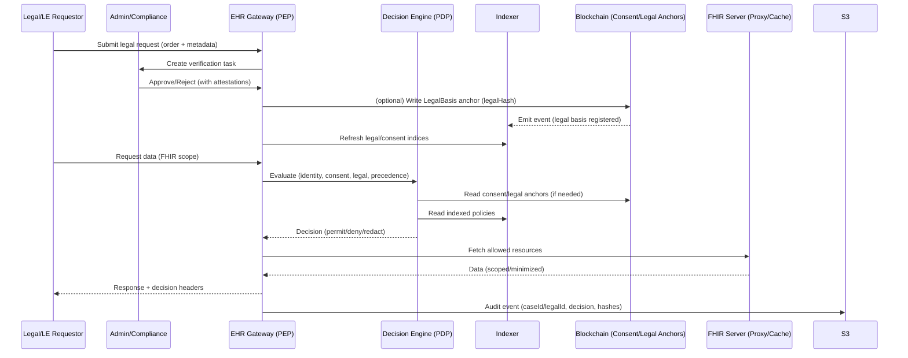

<!-- markdownlint-disable MD036 -->

# 🧩 Addendum v0.1a — Legal / Law-Enforcement Requestors

> **Scope:** Extend the EHR Consent Platform’s conceptual architecture to support *authorized legal or law-enforcement* requests for patient data while preserving HIPAA alignment, auditability, and least-privilege access. This addendum builds on the existing platform components (Frontends, EHR Gateway, Auth Service, Consent Indexer, Audit Pipeline, Blockchain layer, FHIR Server).

- --

## 1) New Actor & Roles

- *Actor:** Legal / Law-Enforcement Requestor (LLER)
- *Personas:**

- Court-authorized officers (e.g., with subpoena/warrant)
- Hospital compliance/legal staff acting as verifiers
- External counsel with court order

- *Authorization Scopes (proposed):**

- `ller:request:create` – submit a legal data access request
- `ller:request:read` – view status, receipts, audit excerpts
- `admin:ller:verify` – compliance/legal verification workflow
- `system:ller:enforce` – machine-to-machine enforcement at Gateway

These scopes integrate with the **unified OAuth2 provider** already planned for the platform.

- --

## 2) Legal Request Lifecycle (Parallel to Consent Lifecycle)

1. **Submit Legal Basis**
   - LLER submits a request with legal basis metadata (caseId, court, orderType, jurisdiction, effectiveFrom/Until, resource scope, purposeOfUse).
   - Attachments: signed order (PDF), digital signature/assertion.

2. **Verify & Attest**
   - Admin/Compliance reviewer validates authenticity and scope (manual + automated checks).
   - System issues **Attestation Record** (hash of legal docs + metadata) and **Legal Basis ID** (`legalId`).

3. **Register Legal Basis (Off-Chain + On-Chain Anchor)**
   - Off-chain: store legal packet & metadata in S3 (WORM), compute `legalHash`.
   - On-chain (optional but recommended): write a minimal **LegalBasis anchor** referencing `legalHash`, validity window, and jurisdiction to improve audit integrity (similar pattern to `scopeId` in Consent).
   - Indexer ingests events for fast PDP checks.

4. **Enforcement at Gateway (PEP/PDP)**
   - For each data request, PDP evaluates:
     - **Consent path** (standard patient consent rules),
     - **Legal path** (valid, verified legal basis),
     - **Precedence rules** (see §3).
   - Outcome: `Permit | Deny | Permit with redaction | Escalate (human review)`.

5. **Audit & Notification**
   - Immutable event trail to S3 with caseId/legalId.
   - Patient notification rules:
     - Default: notify patient/representative,
     - Suppression/Delay: if the order mandates nondisclosure for a time window (tracked in metadata).

6. **Expiry & Legal Hold**
   - Automatic expiry at `effectiveUntil` unless extended.
   - Legal holds extend retention for all associated audit artifacts.

- --

## 3) Precedence & Decision Matrix

- *Sources considered by PDP (ordered evaluation):**

1. **Identity & Role** (OAuth2 scopes): patient, provider, admin, LLER.
2. **Consent Status** (on-chain active/revoked + index).
3. **Legal Basis** (verified, in-window, within resource/jurisdiction scope).
4. **Emergency Break-Glass** (if separately adopted; requires strict post-hoc review).

- *Precedence Rules (proposed):**

- If **valid legal basis** exists and conflicts with patient consent (e.g., revoked), **legal basis may override** *only* for the specifically authorized scope and time window; all access is **minimized and fully audited**.
- If **no valid legal basis**, fall back to standard consent rules (deny if no consent).
- If both allow, return **intersection** (minimum necessary principle).

- --

## 4) Data Scope, Minimization & Redaction

- LLER requests must declare **FHIR resource classes** (e.g., `Observation`, `DiagnosticReport`) and any constraints (encounter/date range).
- PDP enforces **minimum necessary**:
  - Filter by patient, date, encounter, code, or sensitivity tags.
  - Apply masking/redaction where allowed (e.g., remove identifiers/notes beyond scope).

- *Phase 1 (Proxy/Cache):** enforce via the **EHR Gateway** and FHIR proxy/cache without storing PHI beyond cache TTLs; indexer stores only references/hashes/decisions.

- --

## 5) Storage, Audit, and Retention

- **S3 Archive (WORM)** continues to be the durable audit store; tag records with `caseId`, `legalId`, `orderType`, `jurisdiction`.
- **Retention Policies:**
  - Baseline HIPAA retention + **Legal Hold** extensions until the case is resolved plus defined buffer.
- **Real-Time Analytics (Future):** extend the **Audit Pipeline** to stream legal-access telemetry for dashboards/alerts while respecting access control.

- --

## 6) Smart Contracts & Indexer Extensions

- *New (optional) contract:** `LegalBasisRegistry`

- Minimal anchor: `legalId`, `legalHash`, `validFrom`, `validTo`, `jurisdictionCode`, `status`.
- No PHI or document content on-chain; only integrity & status anchors (mirrors the consent approach).
- **Consent Indexer** gains a sibling **Legal Indexer** or an extended schema to ingest `LegalBasisRegistry` events for PDP.

- *Rationale:** Keeps authoritative, tamper-evident trace of legal preconditions without exposing sensitive data. Aligns with existing **contracts + indexer** pattern.

- --

## 7) API & SDK Additions

- *Gateway / API**

- `POST /legal-requests` – submit legal request (metadata + attachments)
- `POST /legal-requests/{id}/verify` – admin/compliance verification
- `GET /legal-requests/{id}` – status & audit excerpts
- `GET /fhir/...` – existing paths augmented with legal decision context in response headers (e.g., `X-Decision-Basis: legal|consent|both`)

- *SDK (JS & Python)**

- `submitLegalRequest(payload, files)`
- `verifyLegalRequest(id, decision)`
- `getLegalRequest(id)`
- Helper: `computeLegalHash()` to align with on-chain anchor pattern.

- --

## 8) UI/UX Considerations

- *Admin Dashboard**

- Legal intake queue & verification workflow
- Evidence viewer (redacted), signature/certificate checks
- One-click anchor/attest action & audit trail timeline

- *Clinic Console**

- Read-only visibility when a legal hold affects a patient’s data (no PHI leakage; metadata only)

- *Patient Portal**

- Notifications center showing legal access events (subject to nondisclosure windows)
- Appeals/Inquiry link (routes to compliance team)

Frontends already exist (Patient/Clinic/Admin) to host these features.

- --

## 9) Security & Governance

- **Strong Identity Proofing** for LLER accounts (step-up auth, hardware keys).
- **Document Authenticity** checks (cryptographic signatures, certificate chains, revocation lists).
- **Jurisdiction Mapping** to enforce region-specific rules (data residency constraints) through Gateway policies.
- **Comprehensive Audit**: append-only logs, per-event digests, periodic checkpoint hashes.

- --

## 10) Sequence (Mermaid)

## 11) Compatibility with Current Architecture

- Reuses existing Gateway, Auth Service, Indexer, Audit Pipeline, Blockchain patterns, adding a narrow LegalBasis anchor and verification workflow with minimal surface area change.
- Preserves “PHI never on-chain” principle; only hashes/anchors on chain.
- Fits the current infra (Terraform, S3, K8s) and CI/CD posture.

## 12) Open Decisions (Legal Track)

- On-chain legal anchor (recommended) vs. off-chain only.
- Jurisdiction taxonomy & mapping rules.
- Notification policy for gag orders / nondisclosure windows.
- Break-glass policy & post-hoc review.
- Certificate trust and revocation checking process.
