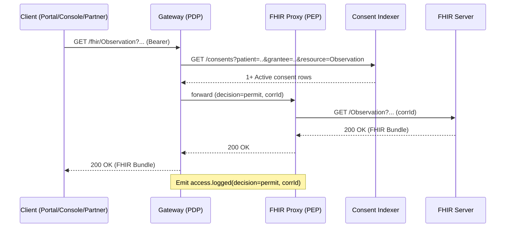

# Milestone M3.1 — FHIR Proxy Minimal Implementation (Read-Only)

Goal: Ship a safe, read-only FHIR proxy that enforces PDP decisions and produces auditable traces for selected resource types.

## Scope (Minimal, production-safe)

- Endpoints (read-only):
  - GET /fhir/Observation?...
  - GET /fhir/DiagnosticReport?...
- Enforcement path:
  - Call existing PDP (Gateway /v1/access/decision) before forwarding.
  - Deny with 403 when no active consent (reuse response schema).
- Proxy behavior:
  - Forward permitted requests to configured FHIR backend (HAPI/local).
  - Return upstream response verbatim (no mutation yet).
- Audit & telemetry:
  - Emit access.logged event with corrId, resource type, decision.
  - Prometheus counters: fhir_proxy_requests_total{decision=permit|deny,resource=...} and fhir_upstream_latency_ms.
- Resiliency:
  - Timeouts & retries to upstream FHIR (e.g., 1s timeout, 2 retries, jitter).
  - Circuit-breaker (trip after consecutive failures; fast-fail until half-open).

## Non-Goals (deferred to later milestones)

- Redaction/masking and consent scope-based field filtering.
- Write operations (POST/PUT/PATCH/DELETE).
- Residency-aware routing, multi-backend routing rules.
- Complex search normalization beyond pass-through.

## Configuration

- FHIR_BASE_URL: upstream FHIR server URL
- FHIR_TIMEOUT_MS: timeout for FHIR requests
- FHIR_RETRIES: number of retries for FHIR requests
- ALLOWED_RESOURCES: v1:Observation,DiagnosticReport
- AUDIT_SINK: (stdout|event-bus|http) (start with stdout)

## API Shape (Gateway)

- Inbound: GET /fhir/{ResourceType}?... (requires bearer token, same as other Gateway routes)
- Internal PDP call: POST /v1/access/decision with {patientId, granteeId?, scopeId?} (reuse existing)
- Outbound to FHIR: GET {FHIR_BASE_URL}/{ResourceType}?... with propagated corrId header

## Sequence (permit path)

## Error Behaviors

- No active consent → 403 with JSON {error, decision:"deny", reason:"no_active_consent", correlationId}.
- Indexer unreachable (from PDP) → 403 with JSON {error, decision:"deny", reason:"indexer_unavailable", correlationId}.
- FHIR upstream timeout → 504 with JSON {error, decision:"deny", reason:"upstream_timeout", correlationId}.
- Circuit open → immediate 503 with JSON {error, decision:"deny", reason:"upstream_unavailable", correlationId}.

## Acceptance Criteria

- Requests for Observation/DiagnosticReport:
  - Permit with active consent; Deny without consent.
- Each request produces one audit event with corrId.
- /metrics exposes request counters and upstream latency histogram.
- Load test (local) confirms < 350 ms P99 overhead through proxy (with warm upstream).
- Integration tests cover:
  - permit/deny logic
  - FHIR upstream timeout → 504
  - circuit-breaker trip & recover
  - metrics presence

## Tasks

- PX-1: Route wiring GET /fhir/:resource → PDP → proxy.
- PX-2: Upstream client with timeout/retry/circuit-breaker.
- PX-3: Audit emitter & metrics for proxy path.
- PX-4: Config + env validation; health & readiness endpoints.
- PX-5: Tests (unit + integration); synthetic FHIR fixtures in qa/.
