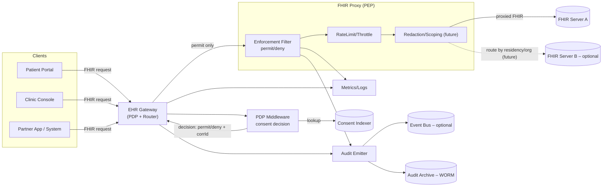

# FHIR Proxy - Architext Concept

```mermaid

flowchart LR
  %% Clients
  subgraph Clients
    PP[Patient Portal]
    CC[Clinic Console]
    API[Partner App / System]
  end

  %% Gateway/PDP
  GW["EHR Gateway\n(PDP + Router)"]
  PDP["PDP Middleware\nconsent decision"]
  AUD[Audit Emitter]
  METRICS[Metrics/Logs]

  %% Proxy/PEP
  subgraph Proxy["FHIR Proxy (PEP)"]
    ENF["Enforcement Filter\npermit/deny"]
    REDACT["Redaction/Scoping (future)"]
    RL[RateLimit/Throttle]
  end

  %% Data Plane
  IDX[(Consent Indexer)]
  FHIRA[(FHIR Server A)]
  FHIRB[(FHIR Server B – optional)]
  BUS[(Event Bus – optional)]
  S3[(Audit Archive – WORM)]

  %% Flows
  PP -->|FHIR request| GW
  CC -->|FHIR request| GW
  API -->|FHIR request| GW

  GW --> PDP
  PDP -->|lookup| IDX
  PDP -->|decision: permit/deny + corrId| GW

  GW -->|permit only| ENF
  ENF --> RL
  RL --> REDACT
  REDACT -->|proxied FHIR| FHIRA
  REDACT -.route by residency/org (future).-> FHIRB

  %% Observability / Audit
  GW --> AUD
  ENF --> AUD
  AUD --> BUS
  AUD --> S3
  GW --> METRICS
  ENF --> METRICS
```
