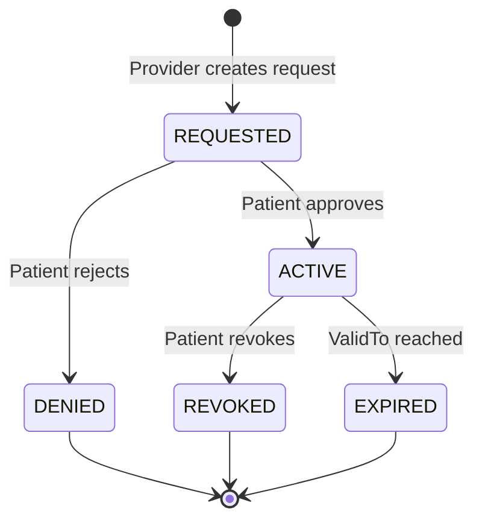

<!-- markdownlint-disable MD036 -->

# 🧩 Addendum v0.1b — Dual Consent Initiation (Patient & Provider)

> **Scope:** Extend the EHR Consent Platform to support both **patient-initiated** and **provider-initiated** consent creation, including workflow, security, and compliance implications. This addendum builds on the existing system design, smart contract structure, and frontend roles (Patient Portal, Clinic Console).

- --

## 1) Overview

Current architecture allows consent to be created and validated between patients, providers, and institutions. This enhancement introduces **two initiation pathways**:

- **Patient-Initiated Consent:** A patient grants access to a clinic or provider (which may or may not yet exist in the registry).
- **Provider-Initiated Consent:** A clinic or provider requests consent from a patient (often during onboarding or treatment authorization).

Each pathway impacts verification, workflow, and audit mechanics across both the **on-chain** (`ConsentRegistry`, `ProviderIdentity`, `HospitalRegistry`) and **off-chain** (Indexer, Gateway, Audit) components.

- --

## 2) Initiation Scenarios & Core Impacts

### 🧍‍♀️ Patient-Initiated

- Patient selects or enters a provider/clinic.
- Consent generated via Patient Portal → validated by EHR Gateway → stored on-chain.
- May involve **unverified or new providers**.

- *Impacts:**

- Requires **“pending provider verification”** process prior to full consent activation.
- Smart contract must handle **provisional `grantee` entries** (off-chain first, then anchored once verified).
- Consent record includes:
  - `initiator = patient`
  - `verificationState = pending | verified`
  - `granteeType = provider | organization`

- --

### 🏥 Provider-Initiated

- Provider requests consent from a patient (e.g., for new patient onboarding).
- Request remains **pending** until the patient confirms.

- *Impacts:**

- Introduces **pending consent** workflow:
  - States: `REQUESTED → ACTIVE → DENIED → REVOKED`
- Requires a **notification and approval mechanism** (via Patient Portal or secure tokenized link).
- Smart contract logic:
  - `createConsentRequest()` (provider)
  - `approveConsent()` (patient)
  - `rejectConsent()` (patient)

- --

## 3) Trust & Verification Flow

- *Current registries:**

`ProviderIdentity` and `HospitalRegistry` store verified identities and institutional memberships.

- *New off-chain layer:**

- **PendingVerificationStore** (DB table or microservice) for unverified providers.
- Upon validation (e.g., license lookup, NPI verification), system triggers blockchain registration.

- *Verification States**

| State | Meaning | Trigger |
|--------|----------|---------|
| `unverified` | Provider submitted but not verified | Patient-initiated consent creation |
| `pending` | Verification in progress | Admin or automated check |
| `verified` | Added to `ProviderIdentity` | Blockchain event emitted |
| `rejected` | Verification failed | Consent auto-invalidated |

- --

## 4) Workflow & State Transitions



### Patient-Initiated Flow

- Patient submits consent request for provider.
- System checks ProviderIdentity registry.
- If unverified → create pending verification record.
- Consent created in pending or active state depending on verification outcome.
- Indexer syncs consent + provider metadata for Gateway enforcement.

### Provider-Initiated Flow

- Provider sends consent request (with metadata, legal credentials).
- Gateway validates and logs to blockchain (REQUESTED state).
- Patient notified → approves or rejects.
- Indexer updates state accordingly.
- Gateway enforces only ACTIVE consents.

## 5) Frontend & UX Implications

- *Patient Portal**

- New “Pending Requests” section.
- Consent cards show:
  - Provider details (verified/unverified).
  - Initiator badge (Patient / Provider).
  - Approve / Reject actions.

- *Clinic Console**

- “Consent Requests” panel to track pending approvals.
- Visual feedback when patient approves.
- Ability to resend notifications.

- *Admin Dashboard**

- “Provider Verification Queue.”
- Manual review and approval tools.

Frontends already exist (patient-portal, clinic-console, admin-dashboard), enabling incremental implementation.

## 6) Smart Contract Modifications

Contract: ConsentRegistry.sol

```solidity
enum ConsentState { Requested, Active, Denied, Revoked, Expired }
address initiator;
address grantee;
ConsentState state;

event ConsentRequested(address indexed provider, address indexed patient);
event ConsentApproved(address indexed provider, address indexed patient);
event ConsentRevoked(address indexed provider, address indexed patient);

function createConsentRequest(address patient, bytes32 scopeId) external;
function approveConsent(uint256 consentId) external;
function rejectConsent(uint256 consentId) external;

```

## 7) Consent Indexer & Gateway Impacts

| Component | New Responsibility |
| --- | --- |
| Consent Indexer | Track pending consents and provider verification events. |
| EHR Gateway (PEP) | Enforce only active consents; provide detailed audit log of initiator, state, and verification status. |
| Auth Service | Validate identities during request creation; issue scoped tokens. |

Enforcement logic at Gateway ensures that pending consents cannot authorize data access until fully active.

## 8) Compliance, Legal, and Audit

- *Compliance Implications**

- All consents must be traceable to a verified identity.
- Pending or unverified providers cannot access PHI until verification is complete.
- Patients retain the right to revoke or deny requests anytime.
- **Initiator field** crucial for HIPAA auditability.

- *Audit Enhancements**

- Audit events:
  - consent.requested
  - consent.approved
  - consent.rejected
  - provider.verified
- Recorded in S3 archive with timestamps and signature hashes.

## 9) System Architecture Additions

- *New Services (proposed):**

1. **Consent Orchestrator**: Handles initiation workflows, verification dependencies, and state transitions.
2. **Notification Service**: Sends patient approval notifications (email/SMS/portal).
3. **Verification Agent**: Integrates with national provider registries (NPI, medical license, or blockchain-based credentials).

Deployment: Add these to the /services/ folder under the existing monorepo.

## 10) Future Enhancements

- Delegated Consent: Legal representatives or guardians can approve on behalf of patients.
- Consent Templates: Providers can predefine standard scopes for faster onboarding.
- Multi-party Consent: Add support for multi-signature approvals (e.g., provider + specialist).
- AI-Enhanced Verification: Use ML models to predict fraudulent or duplicate provider identities.

## 11) Open Design Questions

1. Should unverified providers be visible to patients before verification completes?
2. Should consent requests expire automatically if not acted upon within a defined window?
3. How should revocation propagate — immediate blockchain event or scheduled cleanup job?
4. Should consent templates be standardized (FHIR Consent format) or custom JSON policies?
5. What notification cadence ensures compliance without over-communication?
