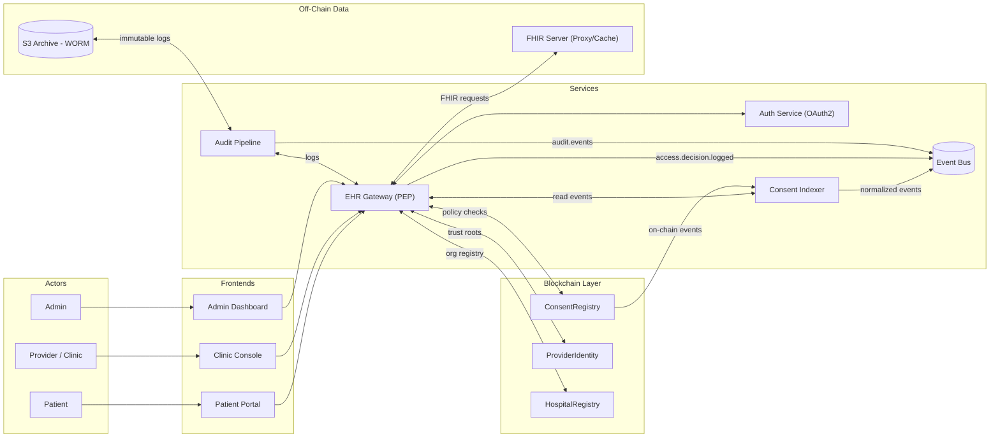
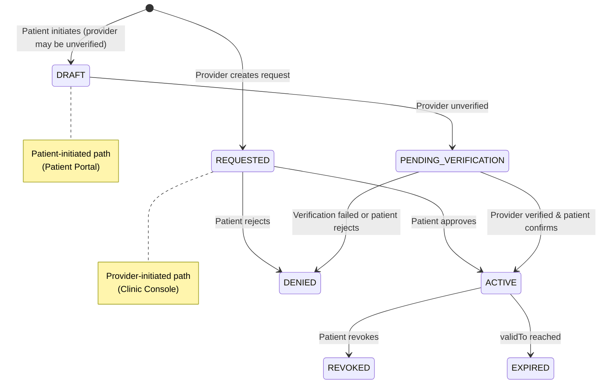
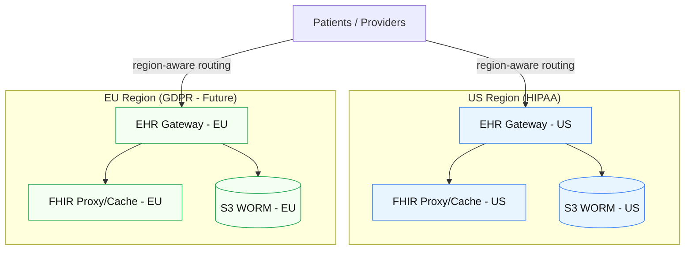

<!-- markdownlint-disable MD036 -->

# 🧠 EHR Consent Platform — Clarification Summary (All 9 Questions)

> **Purpose:** Consolidate all nine clarification questions and answers into a single architectural reference.
> This summary refines the conceptual design for the EHR Consent Platform, aligning the blockchain, backend, frontend, and compliance strategies. filecite31:0†README.md†L16-L37

- --

## 1) Consent Model Scope

- *Q:** Does the ConsentRegistry manage granular consent or broader access? Are revocation and expiration handled on-chain or off-chain?
- *A:** **Both** granular and broad consent are supported. Revocation/expiration handling is **to be confirmed**, but on-chain management is preferred for auditability.

- *Design Implications**

- The smart contract should record minimal, authoritative states: `subject`, `grantee`, `scopeId`, `status`, `validFrom`, `validTo`.
- Off-chain, JSON/FHIR policy stores define detailed scopes and constraints.
- Indexer syncs on-chain events and expands them into queryable data for the Gateway.

- --

## 2) FHIR Integration Depth

- *Q:** Will the FHIR Server act as a proxy/cache or a full data store?
- *A:** Initially, it will be a **proxy/cache layer**; future decision likely to enable **full validation and transformation**.

- *Design Implications**

- EHR Gateway proxies FHIR requests, enforcing consent and caching responses.
- FHIR Server architecture must allow gradual migration from proxy-only to data store.
- Audit pipeline stores hashed metadata for all proxied interactions.

- --

## 3) Audit Pipeline Role

- *Q:** Is the Audit Pipeline compliance-only or analytics-oriented?
- *A:** **Both** — compliance-first (S3/WORM), later extended for **real-time analytics**.

- *Design Implications**

- Start with S3 Object Lock for immutability.
- Later, stream events into Kinesis/OpenSearch or Kafka for monitoring and anomaly detection.
- Audit event schema: `eventId`, `timestamp`, `actor`, `action`, `result`, `chainRef`, `policyRef`.

- --

## 4) Authentication & Authorization

- *Q:** Is NextAuth.js only for frontends or unified for all services? Will there be existing SSO integration?
- *A:** A **unified OAuth2 provider** backs all frontends and backend services. Integration with existing SSO (SMART on FHIR, Okta, etc.) is likely later.

- *Design Implications**

- Single source of truth for identity.
- OAuth2 scopes (`patient:*`, `provider:*`, `admin:*`, `system:*`).
- Eventual federation with enterprise IdPs for health system adoption.

- --

## 5) Smart Contract Interactions

- *Q:** Are blockchain transactions patient-initiated or server-initiated? Multi-chain support?
- *A:** **To be designed** (decision deferred) but **multi-chain support = Yes**.

- *Design Implications**

- Two operational models:
  - *Non-custodial:* patients sign directly (wallets).
  - *Custodial:* backend signs under policy control.
- Consent Indexer supports pluggable chain adapters for L2 (Polygon/Arbitrum).
- Contract interface stability critical for SDK and service adapters.

- --

## 6) Compliance & Data Residency

- *Q:** Which regulations apply (HIPAA/GDPR)?
- *A:** **Initially US HIPAA**, with future compliance for **EU GDPR**.

- *Design Implications**

- **Data Residency:** tag all artifacts by region; keep PHI and logs in-region.
- **HIPAA-first** with later **GDPR extensions** (right-to-erasure, DSR/DSAR workflows).
- Terraform infra gains region-specific stacks (`prod-us`, `prod-eu`). filecite31:0†README.md†L72-L73
- Gateway routing must respect regional data boundaries. filecite31:0†README.md†L23-L25
- GDPR phase adds **Data Subject Request service** for compliant deletions in off-chain stores.

- --

## 7) Inter-Service Communication

- *Q:** REST, gRPC, or event-driven?
- *A:** **Event-driven preferred**, REST/gRPC fallback.

- *Design Implications**

- Introduce **message bus** (Kafka/Redpanda/Pulsar).
- Event schema examples:
  - `consent.requested`, `consent.revoked`, `provider.verified`, `access.logged`.
- Indexer consumes on-chain events → publishes normalized off-chain equivalents.
- REST/gRPC retained for synchronous or external APIs.
- Add **dead-letter queues** and **idempotency keys** for reliability.

- --

## 8) CI/CD & Delivery Strategy

- *Q:** Deployment and automation level?
- *A:** **Unclear product delivery model**, but **initially manual**, automation planned for later phases.

- *Design Implications**

- Retain manual scripts: `./scripts/deploy.sh`, `qa/smoke-tests`, `infra/terraform`. filecite31:0†README.md†L101-L121
- Document full manual promotion workflow (staging → prod).
- Later: GitHub Actions automate infrastructure and k8s canary deploys. filecite31:0†README.md†L128-L134
- Create operational runbooks: `deployment-checklist.md`, `rollback.md`, and version tagging policy.

- --

## 9) SDK Design Intent

- *Q:** Lightweight internal clients or public SDKs?
- *A:** Start **lightweight client wrappers**, later evolve into **public SDKs**.

- *Design Implications**

- Initial use: internal services and frontends via `js-sdk` and `py-sdk`. filecite31:0†README.md†L68-L71
- Future:
  - Public release adds semantic versioning, docs, and security review.
  - Introduce “SDK ADR” defining release thresholds.
- Include example apps (`/sdk/examples`) and OAuth2 bootstrap helpers. filecite31:0†README.md†L24-L25

- --

## Cross-Cutting Summary

| # | Topic | Near-Term Focus | Long-Term Path |
|---|--------|----------------|----------------|
| 1 | Consent Model | On-chain minimal + off-chain detailed policy | Granular, patient-defined scopes |
| 2 | FHIR Layer | Proxy/cache | Full validation, transformation |
| 3 | Audit | S3 immutable logs | Real-time analytics pipeline |
| 4 | Auth | Unified OAuth2 | External SSO (SMART/Okta) |
| 5 | Smart Contracts | TBD signing model | Multi-chain adapters |
| 6 | Compliance | HIPAA | HIPAA + GDPR residency enforcement |
| 7 | Communication | Event-driven | REST/gRPC hybrid mesh |
| 8 | Deployment | Manual | Automated CI/CD |
| 9 | SDKs | Internal wrappers | Public developer kits |

- --

## Architectural Next Steps

1. Implement **event bus** & schema v1.
2. Add **residency middleware** and compliance tagging.
3. Build **runbooks** for manual deployment.
4. Author **SDK ADR** and expand `/sdk` documentation.
5. Begin pilot deployment (HIPAA stack) before extending to GDPR region.

- --

- *End of Clarification Summary — EHR Consent Platform v0.2**

- --

## Visual Summary — Diagrams (v0.2)

### 1) System Context & Event-Driven Backbone

### 2) Consent Lifecycle — Dual Initiation (Patient & Provider)

### 3) Compliance & Residency (HIPAA now → GDPR later)

