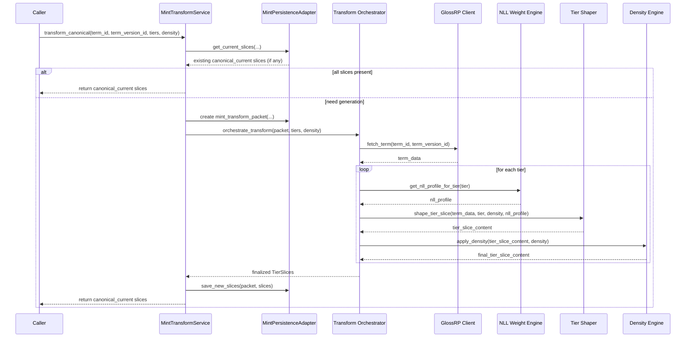

# MINT Internal Modules v1.1  
### (Implementation-Facing Module Specification + Interaction Flow)

## 0. Metadata
- **Subsystem:** MINT (Meaning INference Transformer)
- **Document:** MINT_Internal_Modules_v1.1.md  
- **Status:** Draft v1.1 — Updated with explicit interaction flow  
- **Scope:** Defines the internal modules required to implement MINT in a way that honors:
  - MINT Architecture Manifesto v0.1  
  - MINT Invariants v0.2 (draft)  
  - MINT Slice Lifecycle v0.2  
  - MINT ECL-BASE Schema v0.2  
  - NLL-weighted Tier Identity Model  
  - Breath–Word Integration Note  

This document is for implementation (coding LLMs / engineers).  
It describes *how* MINT should be structured internally to fulfill its conceptual and architectural contracts.

---

# 1. Module Layering Overview

MINT internal modules are grouped into three layers:

1. **Core Shaping Modules** — implement the actual semantic shaping:
   - NLL weighting
   - Tier shaping
   - Density shaping
   - Breath→Word mapping

2. **Operational Orchestration Modules** — control execution flow:
   - Orchestration
   - Lifecycle enforcement
   - Contract checking

3. **Integration & Persistence Modules** — manage:
   - DB reads/writes
   - external system communication (GlossRP, LTF, PW, EnaCs)
   - slice storage and retrieval

All modules must respect MINT’s:
- deterministic nature
- non-interpretive role
- non-generative (no new meaning creation) boundaries
- slice lifecycle rules
- invariants and architecture constraints

---

# 2. Core Shaping Modules

These modules are responsible for *how* MINT shapes meaning into TierSlices.  
They should be **pure**, stateless, and deterministic functions where possible.

---

## 2.1 NLL Weight Engine

**Purpose:**  
Apply the correct NLL gravity model to a given Tier (T1/T2/T3) so that each slice reflects the appropriate weighting of:

- Who  
- What  
- How  
- Where  
- When  
- Why  
- Whom Else  

**Responsibilities:**

- Encode the Tier-specific NLL weighting model (from the NLL–Tier Identity document).
- Expose functions for:
  - `get_nll_profile_for_tier(tier: T1|T2|T3) -> NLLWeights`
- Provide defaults and sanity checks (weights sum normalization if applicable).
- Be deterministic and version-aware (changes to NLL logic must be versioned).

**Notes:**

- This module does not generate text.  
- It only produces structured weight profiles used by TierShaper and downstream logic.

---

## 2.2 Tier Shaper

**Purpose:**  
Generate Tier-specific structured content (T1/T2/T3) using:

- the canonical meaning from GlossRP,
- the NLL profile from NLL Weight Engine,
- and the MINT invariants.

**Responsibilities:**

- For a given `(term_id, term_version_id, tier, density)`:
  - produce the TierSlice content (e.g. markdown/JSON body),
  - ensure that the content aligns with:
    - the Tier’s role (T1 identity, T2 mechanics, T3 systemic purpose),
    - the NLL weighting profile,
    - the invariants (no interpretation, no new meaning).
- Expose a core method, e.g.:
  - `shape_tier_slice(term_data, tier, density, nll_profile) -> TierSliceContent`

**Notes:**

- This is where LLM-backed logic is most likely to be used.
- Must be configured to behave deterministically (e.g. temperature≈0).
- Must not mutate term meaning; only structure and emphasis.

---

## 2.3 Density / DOD Engine

**Purpose:**  
Control the **level of detail** for each TierSlice without changing its *meaning*.

**Responsibilities:**

- Implement Light / Medium / Deep density profiles.
- Ensure that:
  - Light = outline/essential points only
  - Medium = normal operating view
  - Deep = expanded detail (within invariant boundaries)
- Expose a function such as:
  - `apply_density(tier_slice_content, density) -> tier_slice_content`

**Notes:**

- Density must never add new meaning, only expand or compress expression.
- For canonical slices, density profiles must be reproducible.

---

## 2.4 Breath→Word Projection Layer

**Purpose:**  
Map ECL SKY/CORE/BASE essence and intent into concrete UCS Word-level structure.

**Responsibilities:**

- Integrate:
  - MINT’s Breath–Word Integration Note
  - ECL-related contextual metadata (when provided)
- Provide hooks to:
  - receive “essence-level” descriptors (if present),
  - ensure TierShaper honors that essence while structuring content.

**Notes:**

- This layer is more of a *conceptual alignment module* than a heavy logic module.
- It should not add new content; it shapes emphasis and framing in line with the term’s purpose.

---

# 3. Operational Orchestration Modules

These modules govern **how** the core shaping modules are invoked and in what order, and ensure lifecycle and invariants are correctly applied.

---

## 3.1 Transform Orchestrator

**Purpose:**  
Coordinate all internal MINT modules to perform a complete canonical transformation for a given term version.

**Responsibilities:**

- Accept structured requests from the MintTransformService with:
  - `term_id`
  - `term_version_id`
  - requested Tiers
  - density
  - Mint version
  - invariants snapshot
- For each requested Tier:
  - query necessary term data (via GlossRP Client),
  - get the correct NLL profile,
  - call TierShaper,
  - apply Density Engine,
  - use Breath→Word Layer (if relevant essence is provided),
  - assemble TierSlice structures.
- Return TierSlice results to the caller (service layer).

**Notes:**

- Orchestrator does **not** talk to the DB directly.
- It is a pure coordination layer above core shaping modules.
- It must not make lifecycle or persistence decisions — those live in MintTransformService + Persistence Adapter + Lifecycle rules.

---

## 3.2 Invariant Guard

**Purpose:**  
Enforce MINT invariants at runtime.

**Responsibilities:**

- Pre-checks:
  - verify that requested operations comply with invariants:
    - no interpretation
    - no retrieval
    - no evolution
- Post-checks:
  - verify shaped output is structurally valid (no missing fields, no disallowed patterns).
- Provide standardized error states when invariants would be violated.

**Notes:**

- Can be implemented as:
  - decorators,
  - wrapper functions,
  - or middleware around the Orchestrator calls.

---

## 3.3 MintTransformService (Operational Integration Module)

**Purpose:**  
Provide the **single, authoritative interface** for external callers (EnaCs, PW, jobs, APIs) to use MINT in a lifecycle-safe way.

**Responsibilities:**

- Implement the canonical lifecycle-driven operations:
  - **`transform_canonical(term_id, term_version_id, tiers, density)`**
    - Check if canonical-current slices exist via MintPersistenceAdapter.
    - If yes, return them.
    - If not, create a `MintTransformPacket`, invoke the Transform Orchestrator (with Invariant Guard), store new slices, then return.
  - **`regenerate_for_term_version(term_id, term_version_id, tiers, density, scope)`**
    - Mark existing slices for scope as stale/archived via MintPersistenceAdapter.
    - Generate and store new slices as canonical-current.
- Enforce:
  - MINT Slice Lifecycle rules (v0.2).
  - Deterministic behavior for canonical transformations.
- Hide DB details and internal shaping modules from external callers.

**Notes:**

- This module is **implementation-level**, not conceptual.
- All canonical use of MINT must go through this service.
- No direct DB access or direct TierShaper calls from outside.

---

# 4. Integration & Persistence Modules

These modules manage interaction with external systems and MINT’s own database.

---

## 4.1 GlossRP Client

**Purpose:**  
Provide a clean, typed interface for MINT to retrieve canonical meaning from GlossRP.

**Responsibilities:**

- Given `term_id` and `term_version_id`, fetch:
  - canonical TermVersion content (markdown / structured),
  - any necessary metadata (e.g. categories, origin),
  - optional SCSBlocks data (for historical comparison only).
- Handle:
  - API calls or DB queries (depending on deployment),
  - error handling,
  - timeouts, etc.

**Notes:**

- Must respect ECL/MxVA boundaries:
  - MINT never mutates GlossRP data.
- Treat SCSBlocks as **legacy, read-only** historical artifacts only.

---

## 4.2 MintPersistenceAdapter

**Purpose:**  
Handle all interaction with the MINT ECL-BASE schema (PostgreSQL + pgvector).

**Responsibilities:**

- CRUD operations for:
  - `mint_invariant_snapshot`
  - `mint_transform_packet`
  - `mint_tier_slice`
- Utility methods such as:
  - `get_current_slices(term_id, term_version_id, tiers, density)`
  - `mark_slices_stale_or_archived(term_id, term_version_id, tiers, density, scope)`
  - `save_new_slices(packet, slices)`
- Respect Slice Lifecycle states:
  - `canonical_current`
  - `canonical_stale`
  - `archived`
  - `invalidated`

**Notes:**

- No lifecycle decisions should be made here — that belongs to MintTransformService and lifecycle logic.
- This module should be a thin data access layer with clear query/update methods.

---

## 4.3 LTF Adapter (Future-Facing)

**Purpose:**  
Provide LTF (when fully defined) with stable, canonical TierSlices and associated metadata.

**Responsibilities:**

- Surface:
  - for a given `term_version_id`:
    - T1/T2/T3 slices,
    - NLL weights,
    - embeddings (when used),
    - lifecycle/version metadata.
- Support batch exports for LTF ingestion.

**Notes:**

- LTF’s worldview is outside this document.
- This module only ensures that MINT’s outputs are available in a clear, structured way.

---

## 4.4 Logging & Audit Module

**Purpose:**  
Track critical operations for observability and debugging.

**Responsibilities:**

- Log:
  - transformation requests (term_id, term_version_id, tiers, density),
  - slice generation events,
  - regeneration events,
  - invariant violations or errors.
- Provide trace IDs or correlation IDs for cross-system debugging.

**Notes:**

- Must avoid logging sensitive content if any privacy constraints exist.
- Useful for analyzing behavior and drift detection.

---

# 5. Module Interaction Flow (Canonical Path)

This section makes the **execution chain explicit**, so coding LLMs and implementers understand the correct order of module interactions.

## 5.1 High-Level Flow for `transform_canonical`

**Goal:** Return canonical-current TierSlices for `(term_id, term_version_id, tiers, density)`.

**Steps:**

1. **Caller → MintTransformService**  
   - `transform_canonical(term_id, term_version_id, tiers, density)`

2. **MintTransformService → MintPersistenceAdapter**  
   - `get_current_slices(...)`  
   - If all requested slices exist and are `canonical_current` → return them to caller.  
   - Else → proceed to generation.

3. **MintTransformService → MintInvariantSnapshot (via PersistenceAdapter)**  
   - Ensure there is a current `mint_invariant_snapshot` for this Mint version/invariants version.  
   - If not, create one.

4. **MintTransformService → MintTransformPacket (via PersistenceAdapter)**  
   - Create a `mint_transform_packet` row that records:
     - term_id, term_version_id  
     - invariant_snapshot_id  
     - mint_version  
     - bundle_mode, requested tiers/density

5. **MintTransformService → Transform Orchestrator (with Invariant Guard)**  
   - Pass:
     - term_id, term_version_id  
     - tiers, density  
     - invariant snapshot metadata  
   - Invariant Guard performs pre-checks.

6. **Transform Orchestrator → GlossRP Client**  
   - Fetch canonical term data for `term_id`, `term_version_id`.

7. **Transform Orchestrator → NLL Weight Engine**  
   - For each Tier, call `get_nll_profile_for_tier(tier)`.

8. **Transform Orchestrator → Tier Shaper**  
   - For each requested Tier:
     - produce TierSliceContent using term data + NLL profile.

9. **Transform Orchestrator → Density / DOD Engine**  
   - Adjust TierSliceContent to requested density.

10. **Transform Orchestrator → Breath→Word Projection Layer** (if relevant)  
    - Align framing and emphasis with Breath–Word / ECL intent (if provided).

11. **Invariant Guard (Post-Checks)**  
    - Validate that resulting slices:
      - conform to invariants,
      - contain required structural elements,
      - do not violate MINT’s non-interpretive / non-generative boundaries.

12. **Transform Orchestrator → MintTransformService**  
    - Return finalized TierSlice structures for storage.

13. **MintTransformService → MintPersistenceAdapter**  
    - Save TierSlices as `mint_tier_slice` rows with:
      - `state = canonical_current`
      - appropriate lifecycle metadata.

14. **MintTransformService → Caller**  
    - Return the newly canonical-current slices.

---

## 5.2 Regeneration Flow

For `regenerate_for_term_version(term_id, term_version_id, tiers, density, scope)`:

1. **Caller → MintTransformService**  
2. **MintTransformService → MintPersistenceAdapter**  
   - Mark slices in scope as `canonical_stale` or `archived`.  
3. **MintTransformService** then follows steps 3–14 of the canonical flow above.  

This guarantees that after regeneration:

- no older slices remain incorrectly labeled as `canonical_current`.  
- all canonical reasoning uses the new slices.

---

## 5.3 Mermaid-Style Interaction Sketch (Conceptual)

> Conceptual only; implementation does not need Mermaid.

---

# 6. Notes for Coding LLMs / Implementers

1. **Do NOT bypass MintTransformService**  
   - All external systems must go through this service.

2. **Do NOT write application code that manipulates MINT DB tables directly**  
   - Use MintPersistenceAdapter methods instead.

3. **Do NOT introduce randomness in Tier shaping for canonical paths**  
   - Configure model calls for deterministic behavior.

4. **DO keep modules small and testable**  
   - NLL Weight Engine, Tier Shaper, Density Engine should be unit-testable.

5. **DO version behavior changes**  
   - When modifying NLL logic or Tier shaping behavior, bump Mint version and/or invariants version.

6. **DO honor lifecycle and state machine rules**  
   - Use MINT Slice Lifecycle v0.2 for all state transitions and regeneration logic.

---

# 7. Future Extensions (Non-Canonical)

The following are **possible future modules**, but are NOT to be implemented in canonical MINT v1.1:

- **MintVariantExplorer** — experimental shaping with variant phrasing / non-deterministic modes.
- **MintUIHelper** — formatting assistance for direct human-facing tools.

Any such modules must:

- be explicitly labeled non-canonical,
- never write to canonical TierSlice storage,
- never be used by LTF or EnaCs for system reasoning.

---

# 8. Closing Statement

This Internal Modules specification v1.1 defines the minimal, necessary structure to implement MINT in a way that:

- respects its architecture and invariants,
- enforces its lifecycle (v0.2),
- integrates cleanly with GlossRP and the MINT ECL-BASE schema,
- provides a safe interface for EnaCs, PW, and other systems,
- and remains deterministic, stable, and testable.

Implementation details (frameworks, patterns, etc.) may vary,  
but these modules, their responsibilities, and the interaction flow must remain recognizable and intact.
