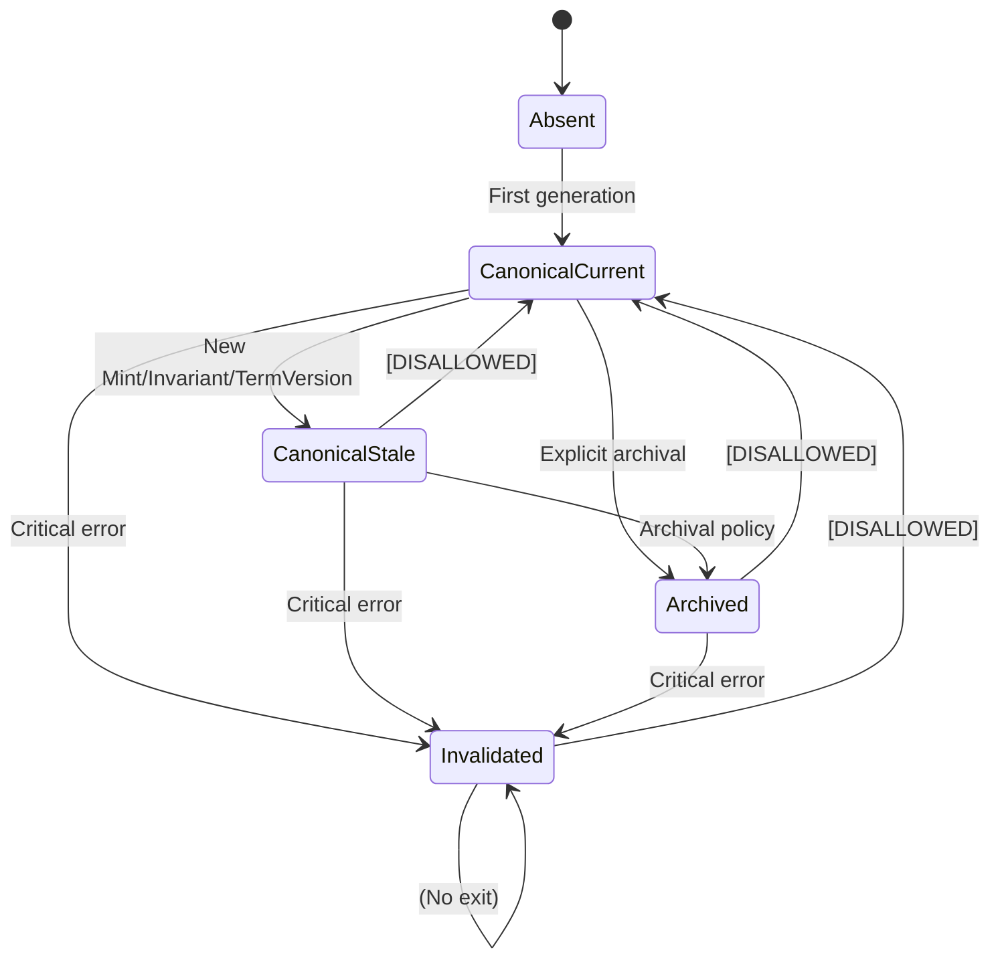

# MINT Slice Lifecycle v0.2  
### (Canonical Lifecycle Specification + Reserved Variation Concept + State Machine)

## 0. Metadata
- **Name:** MINT (Meaning INference Transformer)
- **Document:** MINT_Slice_Lifecycle_v0.2.md  
- **Status:** Draft — Updated with formal state machine  
- **Purpose:** Define *precisely* when, why, and how Mint TierSlices are created, regenerated, stored, invalidated, and consumed.  
- **Includes:** Reserved conceptual definition of “variation mode,” NOT executable, NOT active.

---

# 1. Guiding Principles

### 1.1 Deterministic Canonical Output  
MINT **must** produce deterministic, invariant-bound results for canonical TierSlices:  

> Same `term_version_id` + same `mint_version` + same `invariants_version` + same `density` + same `tier` → **same slice**.

### 1.2 Slice Lifecycle is Version-Driven, Not Request-Driven  
Slices are *not* created on every request.  
They are generated only when specific lifecycle events occur (see §3).

### 1.3 Canonical vs Non-Canonical Output  
Only the **canonical transformation path** may generate stored TierSlices.  
Exploratory/variant generation is reserved conceptually, but **non-executable**.

### 1.4 GlossRP Is the Sole Source of Meaning  
MINT shapes meaning but does not store or own canonical meaning.  
It relies on:
- `term_id`
- `term_version_id`
- invariant/reference metadata  

obtained from GlossRP or the GlossRP API.

### 1.5 Lifecycle States Are Explicit and Finite  
Every stored TierSlice exists in exactly one of a small, explicit set of lifecycle states.  
State transitions are defined, intentional, and testable.

---

# 2. Lifecycle States

A Term’s MINT TierSlices can be in one of the following **explicit states**:

- **Absent** — no TierSlice row exists yet for a given `(term_version_id, tier, density, mint_version, invariants_version)`.
- **Canonical-Current** — a stored slice is up-to-date and valid under the current Mint + invariants definition.
- **Canonical-Stale** — a stored slice was valid under a prior Mint or invariants definition, or prior GlossRP `term_version_id`; retained but not used for current reasoning.
- **Archived** — a stored slice has been moved into historical/analysis status; not directly used for operational lookups.
- **Invalidated** — a stored slice is known to be incorrect or unusable (e.g., due to a bug, corrupted content, or structural violation) and must not be used.

The **Variant** concept (non-canonical, exploratory slices) is *not represented as a state* here and remains conceptual only (see §9).

---

# 3. Lifecycle Events (Triggers)

## 3.1 Creation Events (Canonical Slice Generation)

MINT creates canonical slices under **exactly three conditions**:

### **Event A: New TermVersion**  
Triggered when GlossRP emits a new `term_version_id` for a term.  
This represents actual semantic change.

MINT must:

1. **Mark** all prior slices for that `term_id` as `Canonical-Stale` (or `Archived`, depending on policy).  
2. **Generate** fresh T1/T2/T3 slices for the new `term_version_id` (for requested tiers/densities).  
3. **Store** them with `state = Canonical-Current`.

---

### **Event B: New Mint Version (or Invariants Version)**  
MINT slicing logic or invariants evolve.  
This constitutes a new shaping regime.

MINT must:

1. Mark previously `Canonical-Current` slices for affected terms as `Canonical-Stale` or `Archived`.  
2. Generate new slices under the new Mint/invariants version.  
3. Store new slices as `Canonical-Current` and attach them to the appropriate `mint_transform_packet` and `mint_invariant_snapshot`.

---

### **Event C: Explicit Regeneration Request**  
Triggered by a higher-level actor, e.g.:

- EnaC or SAAS orchestration  
- System administrator  
- Maintenance or consistency jobs

MINT must:

1. Treat this as an intentional regeneration event.  
2. Mark applicable prior slices as `Canonical-Stale` or `Archived`.  
3. Generate and store new slices as `Canonical-Current`.

---

## 3.2 Non-Creation Events (Requests That DO NOT Generate New Slices)

### 3.2.1 Slice Retrieval Requests  
Requesting a canonical slice **does NOT** create a new slice by default.

MINT returns the stored canonical slice unless:

- it **doesn’t exist** (Absent), or  
- it is **stale** due to rules in §3.1.

### 3.2.2 Multi-Density / Multi-Tier Requests  
When multiple densities or tiers are requested:

- MINT returns existing `Canonical-Current` slices for each tuple `(tier, density)` if present.
- If one combination is missing (e.g., T3/deep), MINT may generate only that missing slice, under the current Mint/invariants regime, and store it as `Canonical-Current` for that specific combination.

### 3.2.3 LTF and Other Subsystem Requests  
Subsystems such as LTF must see **only `Canonical-Current`** slices by default.  
Requests from LTF do not themselves perform regeneration; they simply consume the current canonical semantic surface.

---

# 4. Canonical Slice Regeneration Rules

### 4.1 Regeneration Scope  
Regeneration operates at a clear scope, such as:

- **By term version**: all tiers/densities for a given `term_version_id`.  
- **By tier**: only T2 slices for a given term version.  
- **By tier + density**: only specific combinations.  

Regeneration must explicitly specify what scope it is targeting.

### 4.2 Regeneration Semantics  
Regeneration **replaces** the canonical slice(s) for the given scope:

1. Prior `Canonical-Current` slices for that scope → `Canonical-Stale` or `Archived`.  
2. New slices → `Canonical-Current`.  

No “partial canonical” state is allowed. After regeneration, all slices in scope are either:
- `Canonical-Current` (new run), or  
- `Canonical-Stale` / `Archived` (previous runs).

### 4.3 Invalidated State  
Slices may be set to `Invalidated` when:

- A bug or semantic error is discovered.  
- A slice is known to violate invariants or structure.  
- A debugging or recovery operation explicitly flags them as unusable.

`Invalidated` slices must never be returned from canonical retrieval calls.

---

# 5. Formal State Machine (Textual)

For a given `(term_version_id, tier, density, mint_version, invariants_version)` combination, the **slice lifecycle** follows these transitions:

**States:**  
- `Absent`  
- `Canonical-Current`  
- `Canonical-Stale`  
- `Archived`  
- `Invalidated`  

**Allowed transitions:**

- `Absent` → `Canonical-Current`  
  - On first canonical generation for that combination.

- `Canonical-Current` → `Canonical-Stale`  
  - On new Mint version, new invariants version, or new `term_version_id`.  
  - On explicit regeneration event.

- `Canonical-Stale` → `Archived`  
  - On archival jobs or explicit archival decision.  

- `Canonical-Current` → `Archived`  
  - On explicit archival for historical reasons (rare, usually after regenerating under a new regime).

- `Canonical-Current` → `Invalidated`  
- `Canonical-Stale` → `Invalidated`  
- `Archived` → `Invalidated`  
  - On discovery of critical errors or corruption.

**Disallowed transitions (examples):**

- `Invalidated` → any other state (must remain invalid; if needed, regenerate a new slice).  
- `Archived` → `Canonical-Current` (should be regenerated instead).  
- `Canonical-Stale` → `Canonical-Current` (must be regenerated, not re-labeled).

---

## 5.1 State Machine Sketch (Mermaid-style)

> This diagram is included as a conceptual aid only.  
> Implementations are not required to support Mermaid rendering.

---

# 6. Slice Storage Rules

### 6.1 Canonical Slices Must Be Stored  
Each canonical slice must include at least:

- Tier (T1/T2/T3)  
- Density  
- NLL-weight vector  
- Mint version  
- Invariant version  
- GlossRP `term_id` and `term_version_id`  
- Content (`content_md` and/or `content_json`)  
- Lifecycle state (`state`)  
- Creation timestamp

### 6.2 Canonical Slices Must Be Indexed for Fast Lookup  

Recommended indexes (as reflected in schema docs):

- `(term_id, term_version_id, mint_version, tier, density, state)`  
- `mint_transform_packet_id`

### 6.3 Separation of Current vs Historical  
Operational lookups for canonical use-cases must:

- Filter on `state = Canonical-Current`.  
- Avoid returning `Canonical-Stale`, `Archived`, or `Invalidated` slices unless explicitly asked for (e.g., analysis views).

---

# 7. Retrieval Rules

### 7.1 Direct Retrieval  
MINT responds to a canonical retrieval request with:

- existing `Canonical-Current` slices if available, or  
- fresh slices generated and stored as `Canonical-Current` when:
  - no slice exists (`Absent`), or  
  - the existing slice is known to be stale or invalid.

### 7.2 Bundle Retrieval  
For multi-tier or multi-density requests:

- MINT collects all `Canonical-Current` slices for each requested `(tier, density)` pair.  
- If missing in scope, MINT may generate slices for those missing combinations and store them as `Canonical-Current`.

### 7.3 Freshness Guarantee  
MINT guarantees that returned slices are:

- canonical  
- current (under the declared Mint/invariants regime)  
- deterministic  
- structurally aligned with invariants and schema

---

# 8. Deprecation & Invalidation

Slices are invalidated under:

- new GlossRP term version (combined with explicit invalidation of old sets),  
- new Mint version or invariants version that renders old slices semantically incorrect,  
- structural upgrades that change the format so old slices can no longer be safely interpreted,  
- discovery of bugs or semantic errors in prior runs.

Invalidation rule:

> If MINT cannot guarantee deterministic correctness and invariant compliance for a slice, that slice is invalid.

Invalidated slices must not be retrieved in canonical flows.

---

# 9. Reserved Section — Variation Mode (Concept Only)

### 9.1 This section is NON-EXECUTABLE.  
Variation mode is **defined**, but:

- not implemented  
- not exposed  
- not used in canonical workflows  
- not persisted  
- not referenced from other subsystems

### 9.2 Purpose of Recording the Concept  
We record this concept here to:

- preserve future design options  
- avoid buried assumptions  
- maintain clarity on canonical vs exploratory shaping  
- prevent accidental “creative drift” in core MINT

### 9.3 Definition of Variation Mode (Conceptual Only)

Variation Mode represents:

- an **exploratory shaping path**  
- potentially allowing:
  - temperature adjustments  
  - alternative phrasing  
  - creative expansions  
  - experimental TierSlices  

But **outputs are:**

- NOT canonical  
- NOT stored in `mint_tier_slice`  
- NOT used for LTF or EnaC system reasoning  
- NOT considered part of MINT-Core

### 9.4 Variation Mode Must Remain Segregated  

Any future implementation must:

- live behind a separate/non-canonical API  
- be explicitly labeled “non-canonical”  
- produce outputs with safeguard boundaries  
- ensure zero interference with MINT-Core determinism and lifecycle

---

# 10. Notes + Future Attachments

### 10.1 Related Documents

- `MINT_Architecture_Manifesto_v0.1.md`  
- `MINT_Invariants_Draft_v0.2.md`  
- `MINT_ECL_BASE_Schema_v0.2.md`  
- `MINT_Internal_Modules_v1.0.md`  
- `LTF_NLL_BW_Integration_Note_v1.0.md`  

### 10.2 Next Possible Document

- `MINT_Slice_Lifecycle_Implementation_Guide_v0.2.md`  
  - API design  
  - regeneration endpoints  
  - EnaC consumption patterns  

---

# 11. Closing Statement

The MINT Slice Lifecycle v0.2:

- encodes an explicit, finite state machine,  
- defines clear transitions and disallowed flows,  
- preserves determinism for canonical semantics,  
- integrates with versioning and invariants,  
- cleanly separates canonical behavior from future exploratory variants,  
- and provides a stable operational substrate for coding LLMs, EnaCs, and LTF (once more fully defined).

It is the authoritative reference for how TierSlices live, change, and retire within the MINT subsystem.
