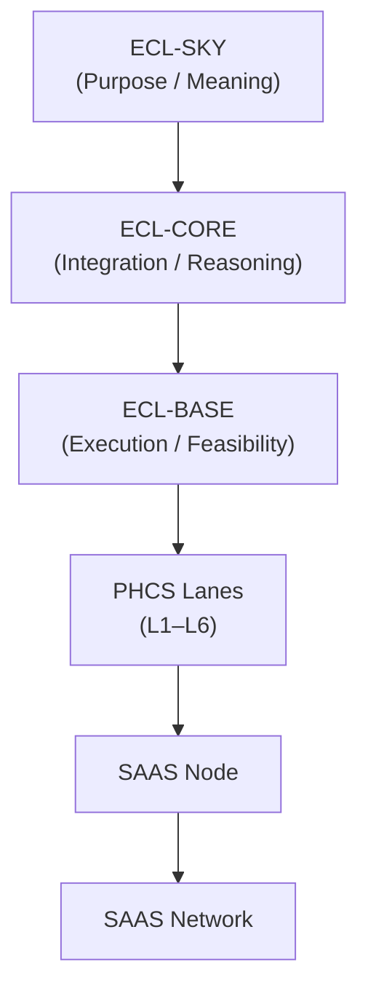

# Cross-Layer Interaction Map (ECL ↔ PHCS ↔ SAAS)

```mermaid

flowchart TD
    SKY["ECL-SKY<br/>(Purpose / Meaning)"]
    CORE["ECL-CORE<br/>(Integration / Reasoning)"]
    BASE["ECL-BASE<br/>(Execution / Feasibility)"]

    PHCS["PHCS Lanes<br/>(L1–L6)"]
    SAAS_Node["SAAS Node"]
    SAAS_Network["SAAS Network"]

    SKY --> CORE --> BASE
    BASE --> PHCS
    PHCS --> SAAS_Node --> SAAS_Network

```