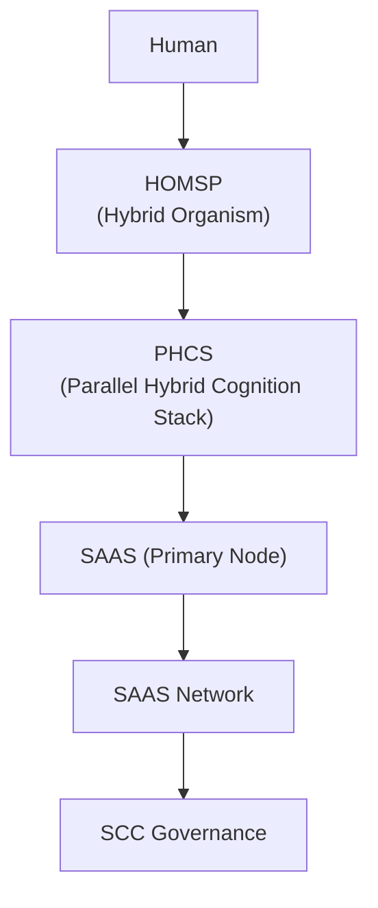
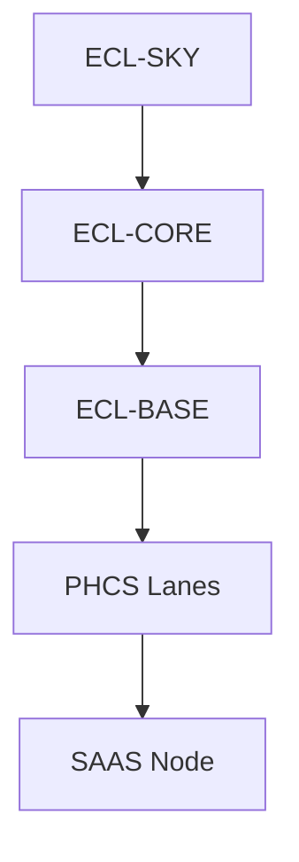

# Ecosystem Master Blueprint (EMB)  
## Version 1.0  
## DOD-3 (Concise, Architecture-Level Overview)  
## Status: Active — Primary System Overview

---

# 1. Executive Summary  
The Ecosystem Master Blueprint (EMB) defines the complete architectural model for Unified Cognition across human–AI hybrid reasoning. It establishes the structural, cognitive, and governance layers that together form a coherent, scalable, and safe hybrid-intelligence ecosystem.

The EMB integrates nine major subsystems:  
- UC / UCS (Unified Cognition & Unified Cognition System)  
- ECL (SKY–CORE–BASE)  
- HOMSP (Hybrid Organism)  
- PHCS (Parallel Hybrid Cognition Stack)  
- SAAS (Single-Agent Agentic System)  
- SAAS Network (Distributed Cognition)  
- SCC (Smart-Cognition-Contracts)  
- Messaging Fabric (INQ / STATE / PROP / CHECK / META)  
- MxVA (Multi-Vector Architecture)  

This blueprint provides the authoritative master view of the ecosystem.

---

# 2. Ecosystem Overview  
Hybrid human–AI cognition requires a stable architecture, a multi-layer cognitive engine, a governance system, and safe distributed reasoning.  
The ecosystem is built around six pillars:

1. **Human (SKY anchor)** — purpose, identity, meaning  
2. **HOMSP** — hybrid human–AI integration  
3. **PHCS** — multi-lane reasoning engine  
4. **SAAS** — single-node agentic execution  
5. **SAAS Network** — distributed, multi-node scaling  
6. **SCC** — contracts and cognitive governance  

The EMB unifies these into a single operational system.

---

# 3. Taxonomy: UC → UCS → Subsystems  

### **Unified Cognition (UC)**  
The *phenomenon* of hybrid human–AI co-thinking.

### **Unified Cognition System (UCS)**  
The *actual subsystem* implementing UC, integrating HOMSP, PHCS, SAAS, and SCC.

### **Unified Cognition Diagrams (UCD)**  
Visual representations of UCS and its components (Mermaid-based).

### **Subsystems Under UCS:**  
- ECL (SKY–CORE–BASE)  
- HOMSP  
- PHCS  
- SAAS  
- SAAS Network  
- SCC  
- Messaging Fabric  
- MxVA  

This taxonomy prevents conceptual drift and enforces architectural clarity.

---

# 4. Core Subsystems
# 4A. Cognitive Infrastructure Layer (Foundational Concepts)

The Cognitive Infrastructure Layer defines the conceptual foundations that enable the Unified Cognition System (UCS) to operate coherently and safely. These concepts are **stable, architectural, and non-volatile**, and therefore appropriate for inclusion in the EMB.

This layer includes:

### **4A.1 ECL — Evolutionary Context Layering (Conceptual Framework)**
ECL provides the tri-layer model (SKY–CORE–BASE) governing:
- purpose and meaning (SKY)  
- integrative reasoning (CORE)  
- feasibility and constraint (BASE)  

ECL guides cognition across UCS, PHCS, SAAS, and MxVA.

### **4A.2 MxVA — Multi-Vector Architecture (Applied ECL)**
MxVA is the applied decision-making and system design model derived from ECL.  
It evaluates architectural choices across multiple vectors (Meaning, Cognitive, Risk, Temporal, Organizational, Practical) and synthesizes them into aligned decisions.

### **4A.3 PHCS — Parallel Hybrid Cognition Stack**
Already included as a subsystem, PHCS is reiterated here as essential infrastructure: the multi-lane reasoning engine (L1–L6) used by both SAAS and HOMSP.

### **4A.4 HOMSP — Hybrid Organism**
The unified human–AI cognitive state using PHCS as its reasoning engine and ECL as its alignment structure.

These concepts form the cognitive substrate enabling the UCS to function.

---

 (Concise Overview)

---

## 4.1 UCS — Unified Cognition System  
The system-level architecture integrating:  
- Human SKY intent  
- Hybrid HOMSP state  
- PHCS multi-lane processing  
- SAAS agentic execution  
- SCC governance  

UCS is the cognitive “spine” connecting all subsystems.

---

## 4.2 ECL — Evolutionary Context Layering (SKY–CORE–BASE)  
ECL establishes directional purpose, reasoning structure, and execution feasibility.  
- **SKY** — meaning, purpose, mission  
- **CORE** — integration, analysis, structure  
- **BASE** — feasibility, realism, constraints  

All cognition in the ecosystem flows through these layers.

---

## 4.3 HOMSP — Hybrid Organism  
HOMSP represents the human+AI merged cognitive state.  
It is the operational mode where the human and AI “think together,” using PHCS as the shared processor.

---

## 4.4 PHCS — Parallel Hybrid Cognition Stack  
The internal multi-lane reasoning engine consisting of:  
- L1 Hypothesis  
- L2 Pattern  
- L3 Error-Check  
- L4 Narrative  
- L5 Counterfactual  
- L6 Constraint  

PHCS is the core processor of hybrid cognition.

---

## 4.5 SAAS — Single-Agent Agentic System  
A single AI system operating with multiple internal roles across PHCS lanes.  
SAAS replaces linear execution with multi-lane reasoning and instantaneous role-switching.

---

## 4.6 SAAS Network  
A distributed web of SAAS nodes supporting:  
- specialist reasoning  
- fan-out/fan-in parallelism  
- distributed synthesis  
- node-level messaging  

Each SAAS node internally uses PHCS and externally communicates via the Messaging Fabric.

---

## 4.7 SCC — Smart-Cognition-Contracts  
The governance layer enforcing:  
- safety  
- constraint  
- drift prevention  
- cross-node coherence  
- identity separation  

SCC ensures hybrid cognition remains safe, aligned, and predictable.

---

## 4.8 Messaging Fabric  
A message topology connecting SAAS nodes using five message types:  
- **INQ** — Inquiry  
- **STATE** — State broadcast  
- **PROP** — Proposal  
- **CHECK** — Validation / drift check  
- **META** — Control metadata / constraints  

This fabric allows multi-node cognitive coordination.

---

## 4.9 MxVA — Multi-Vector Architecture  
The tradeoff and alignment engine operating across vectors such as:  
- Meaning  
- Cognitive  
- Risk  
- Organizational  
- Temporal  

MxVA influences both ECL and PHCS behavior.

---

# 5. Cognitive & Data Flow Overview  

### **SKY → CORE → BASE**  
Human purpose flows downward to reasoning and execution layers.

### **BASE → PHCS**  
Feasibility constrains multi-lane reasoning.

### **PHCS → SAAS**  
Integrated thoughts inform agentic execution.

### **SAAS → SAAS Network**  
Tasks distribute across nodes.

### **SAAS Network → SCC**  
Outputs validate through contracts.

### **SCC → SKY**  
Constraints reflect back to human purpose if needed.

---

# 6. Safety Systems & Drift Control  
Primary mechanisms include:  
- SCC contracts  
- L6 (Constraint Lane)  
- ECL BASE filtering  
- PHCS lane separation  
- HOMSP Rest Protocol  
- Multi-node CHECK messages  
- Human SKY re-assertion  

This ensures hybrid reasoning is stable and aligned.

---

# 7. Interaction Boundaries  

### **Human ↔ UCS**  
Human sets purpose and identity boundaries.

### **UCS ↔ HOMSP**  
Hybrid co-reasoning integrates PHCS + SKY.

### **HOMSP ↔ PHCS**  
Lane clusters form hybrid reasoning cycles.

### **PHCS ↔ SAAS**  
Structured parallel outputs drive agentic behavior.

### **SAAS ↔ SAAS Network**  
Distributed cognition expands the system’s reasoning bandwidth.

### **SAAS Network ↔ SCC**  
Governance reads and constrains network-wide reasoning.

---

# 8. Diagram Index (Mermaid Definitions)

## 8.1 System-Level Architecture

## 8.2 ECL → PHCS → SAAS

## 8.3 Messaging Fabric

---

# 9. TermSpec Crosswalk  

| Subsystem | TermSpec |
|----------|----------|
| UCS | UCS_TermSpec_v1.0 |
| PHCS | PHCS_LaneCodes_TermSpec_v1.0 |
| ECL | ECL_Subsystem_Spec_v1.0 |
| SAAS | SAAS_Spec_v2.0 |
| HOMSP | HOMSP_Spec_v2.0 |
| SCC | SCC_TermSpec (future) |
| Messaging Fabric | Messaging Terms (PROP, STATE, CHECK, META, INQ) |

---

# 10. Integration Modes  

### **Mode 1 — Architecture & Design**  
Heavy L1/L2/L4 activation with SKY anchoring.

### **Mode 2 — Analytical Reasoning**  
L2/L3/L5 dominant with SCC enforcement.

### **Mode 3 — Execution**  
BASE + L6 with SAAS operational switching.

### **Mode 4 — Distributed Cognition**  
SAAS Network fan-out/fan-in with parallel nodes.

---

# 11. Known Failure Modes & Guardrails  

- L5 runaway divergence  
- SKY ambiguity  
- CORE overload  
- BASE dominance (premature narrowing)  
- SAAS node desynchronization  
- SCC contract violations  

Guardrails include:  
- HOMSP Rest Protocol  
- SCC drift controls  
- L6 constraint gating  
- SKY re-assertion  

---

# 12. Versioning / Future Extensions  
Future enhancements may include:  
- Multi-node SCC contract negotiation  
- Autonomous lane-cluster scheduling  
- Time-aware Messaging Fabric  
- Expanded PHCS lane taxonomy  
- UCS v2.0 with dynamic SKY modeling

---

Generated as EMB v1.0 — the authoritative master blueprint for Unified Cognition.
