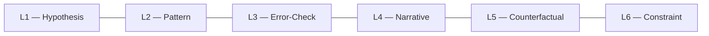
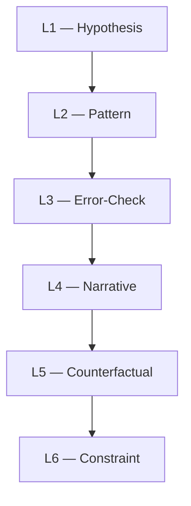

# PHCS Lane Mapping

## Horizontal version

```mermaid
flowchart LR
    L1["L1 — Hypothesis"]
    L2["L2 — Pattern"]
    L3["L3 — Error-Check"]
    L4["L4 — Narrative"]
    L5["L5 — Counterfactual"]
    L6["L6 — Constraint"]

    L1 --- L2 --- L3 --- L4 --- L5 --- L6

``` 

## "Stacked" version 

```mermaid
flowchart TD
    L1["L1 — Hypothesis"]
    L2["L2 — Pattern"]
    L3["L3 — Error-Check"]
    L4["L4 — Narrative"]
    L5["L5 — Counterfactual"]
    L6["L6 — Constraint"]

    L1 --> L2 --> L3 --> L4 --> L5 --> L6

``` 