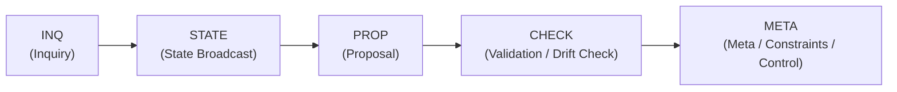

# SAAS Messaging Fabric

```mermaid
flowchart LR
    INQ["INQ<br/>(Inquiry)"]
    STATE["STATE<br/>(State Broadcast)"]
    PROP["PROP<br/>(Proposal)"]
    CHECK["CHECK<br/>(Validation / Drift Check)"]
    META["META<br/>(Meta / Constraints / Control)"]

    INQ --> STATE --> PROP --> CHECK --> META

```