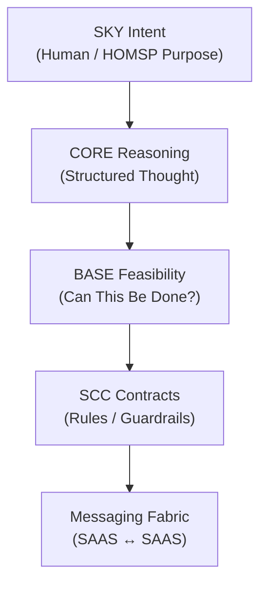

# SCC Governance Stack

```mermaid

flowchart TD
    SKY_INTENT["SKY Intent<br/>(Human / HOMSP Purpose)"]
    CORE_REASON["CORE Reasoning<br/>(Structured Thought)"]
    BASE_FEAS["BASE Feasibility<br/>(Can This Be Done?)"]
    SCC["SCC Contracts<br/>(Rules / Guardrails)"]
    FABRIC["Messaging Fabric<br/>(SAAS ↔ SAAS)"]

    SKY_INTENT --> CORE_REASON --> BASE_FEAS --> SCC --> FABRIC


```