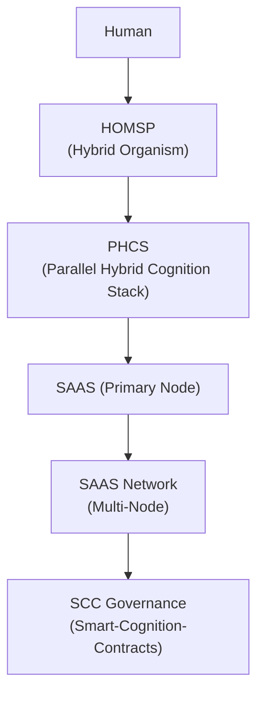

# Unified Cognition System Level

```mermaid
flowchart TD
    Human["Human"]
    HOMSP["HOMSP<br/>(Hybrid Organism)"]
    PHCS["PHCS<br/>(Parallel Hybrid Cognition Stack)"]
    SAAS_Primary["SAAS (Primary Node)"]
    SAAS_Network["SAAS Network<br/>(Multi-Node)"]
    SCC["SCC Governance<br/>(Smart-Cognition-Contracts)"]

    Human --> HOMSP
    HOMSP --> PHCS
    PHCS --> SAAS_Primary
    SAAS_Primary --> SAAS_Network
    SAAS_Network --> SCC
```