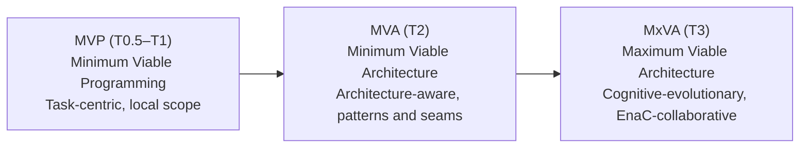
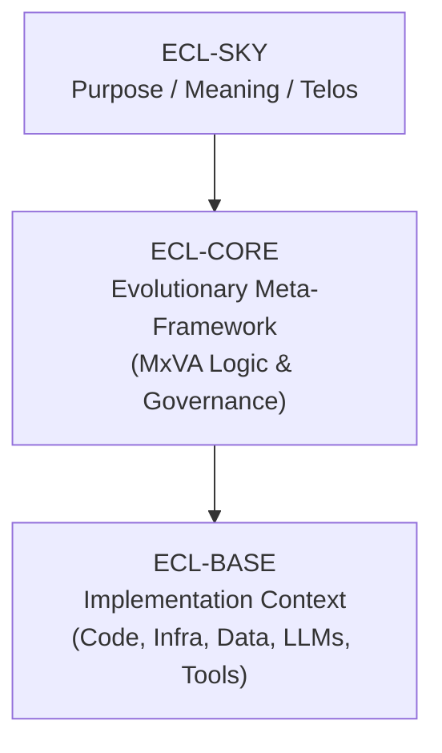
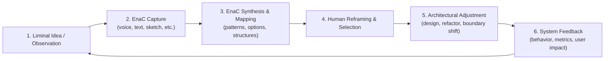
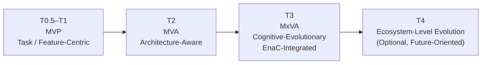
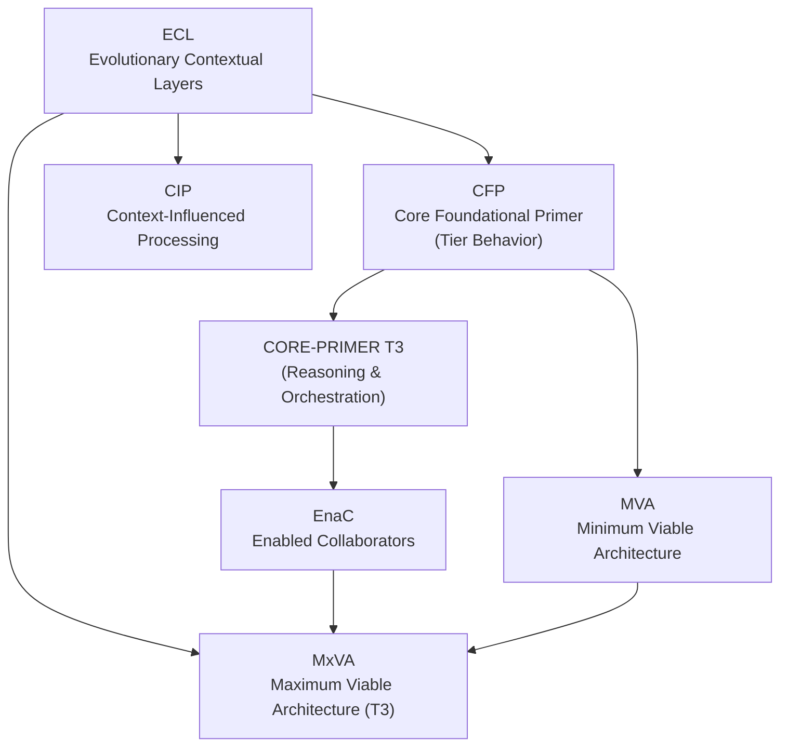

# MxVA Diagram Set v1.0 (ECL-Aligned)

This diagram set visualizes MxVA as a T3 architectural expression under the ECL meta-framework.  
All diagrams are **illustrative**, not prescriptive, and respect ECL’s non-linear, non-hierarchical nature.

---

## 1. MVP → MVA → MxVA in ECL Context

This diagram shows a **typical** (not mandatory) evolution of development practice as ECL activation increases.

**Notes:**
- MVP is dominated by implementation concerns and short-term goals.
- MVA introduces architectural awareness and future evolution options.
- MxVA integrates EnaC cognition, ECL-awareness, and purpose-aligned evolution.

---

## 2. MxVA in the ECL Vertical Model

This diagram maps MxVA into the ECL vertical structure (SKY / CORE / BASE).

**Notes:**
- ECL-SKY holds long-term intent, meaning, and relational purpose.
- ECL-CORE is where MxVA lives conceptually: it governs how architecture evolves.
- ECL-BASE is dynamic and replaceable; systems, stacks, and tools can change without collapsing the architecture’s identity.

---

## 3. MxVA EnaC Cognitive Loop

This diagram illustrates the **recurring cognitive loop** that drives MxVA evolution in practice.

**Notes:**
- This loop is **continuous**, not one-shot.
- EnaCs are co-creators, not passive assistants.
- MxVA emerges when this loop is stable, intentional, and aligned with ECL-SKY.

---

## 4. T-States and Architectural Expressions (Illustrative)

This diagram places MVP, MVA, and MxVA on a **conceptual T-state spectrum**.  
It is a useful mental model, but ECL allows non-linear movement across states.

**Notes:**
- The arrows represent a **typical** maturation path, not a forced progression.
- Regression or lateral movement between states is possible and often necessary.
- T4 is reserved for ecosystem-level evolution (platforms, organizations, multi-system cognition).

---

## 5. MxVA Relationship Map (Framework Interactions)

This diagram shows how MxVA relates to other frameworks in your ecosystem.

**Notes:**
- ECL is the meta-framework; it generates patterns for CFP, CIP, and MxVA.
- CFP and CORE-PRIMER define cognitive behavior (tiers and orchestration).
- EnaC provides cognitive capacity and co-creation.
- MVA is a stepping stone; MxVA is the fully evolved T3 expression.

---

## 6. Usage Guidance

- These diagrams are **conceptual scaffolds**, not implementation diagrams.
- You can paste the Mermaid blocks into compatible tools (e.g., Obsidian, VS Code, Mermaid live editors) to render them visually.
- Future versions can:
  - split diagrams into domain-specific variants (solo dev vs team vs org),
  - add overlays for SELF-ECL, and
  - integrate governance flows explicitly.

