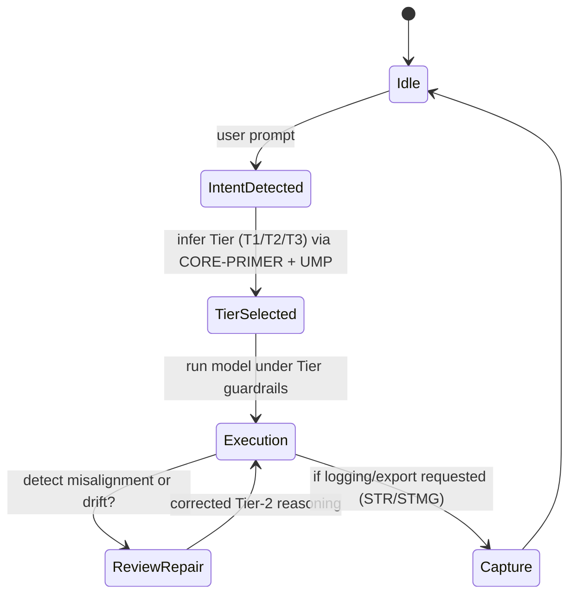
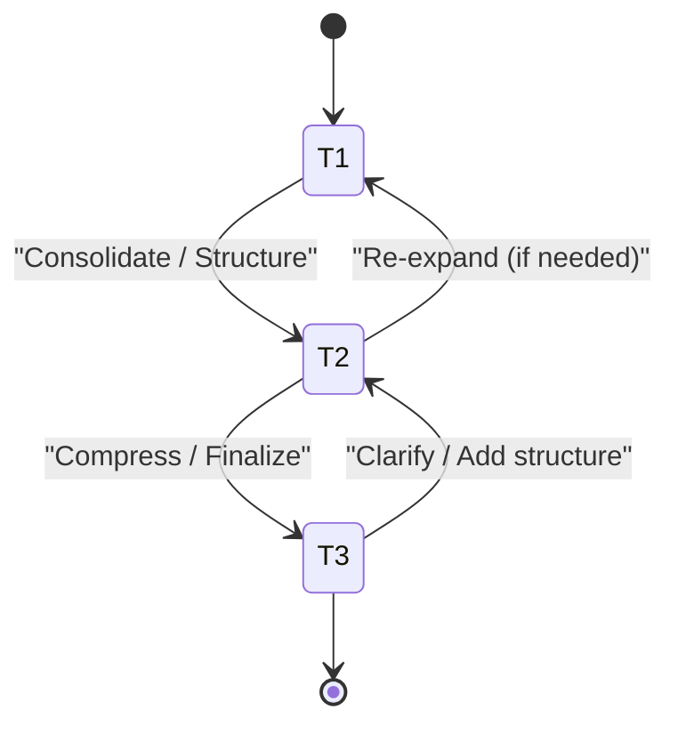

# Cross-LLM Tiered Protocol Blueprint  
**Version:** 0.1 (Draft)  
**Author:** Cash Myers (concept), AI-assisted specification  

---

## 1. Purpose & Scope

This document defines a **vendor-agnostic Tiered Protocol Blueprint** that normalizes the behavior of multiple Large Language Models (LLMs) — such as GPT, Claude, Gemini, Llama, and Mistral — under a shared behavioral contract.

The blueprint provides:

- A **Tiered behavior model** (T1/T2/T3) for reasoning, structure, and compression.  
- **Guardrails** for density, structure, and verbatim fidelity (DOD-1, SCL, Verbatim Rule, STMG).  
- A **Cross-LLM Adapter Layer** that compensates for each model’s native quirks.  
- **State machine definitions** for conversations and tier behavior.  
- **Compatibility tables** for visualizing how guardrails map to different LLMs.  

The goal is simple:

> **Different models, same behavioral contract.**  

---

## 2. Design Principles

1. **Vendor Agnostic**  
   Behavior definitions are not tied to any single LLM vendor, API, or runtime.

2. **Tier-Centric**  
   All reasoning passes through well-defined Tiers:  
   - Tier 1 – Exploration and expansion  
   - Tier 2 – Structuring and proceduralization  
   - Tier 3 – Compression and direct answers  

3. **Guardrail-First**  
   Output density, structure, and format are governed by explicit guardrails:  
   - DOD-1: Default Output Density Guardrail  
   - SCL: Structured Compression Layer  
   - Verbatim Rule: Enforced literal fidelity when required  
   - STMG: Semantic Trigger Markdown Generator (export/logging)

4. **Separation of Concerns**  
   - Runtime conversation behavior vs. archival/export behavior  
   - Model-native behavior vs. protocol-normalized behavior  

5. **Cross-LLM Normalization**  
   Model quirks (verbosity, meta-commentary, summarization bias) are normalized through configuration and adapter logic.

---

## 3. Layered Architecture

### 3.1 Logical Layers

1. **Core Semantic Layer**
   - `CORE-PRIMER` – roles, tiers, rules, guardrails  
   - `UMP` – User Meta-Prompt (preferences, modes, cognitive profile)  
   - `CSAC` – Cross-Session/AI/Context interfaces  

2. **Tiered Protocol Engine**
   - Tier selection and enforcement  
   - Density and structure guardrails (DOD-1, SCL, Verbatim)  
   - Tier-specific behavior rules  

3. **Cross-LLM Adapter Layer**
   - Per-model behavior patches  
   - Normalization of verbosity, recursion, formatting, meta-commentary  

4. **Orchestration & Observability Layer**
   - Task routing (which Tier, which model, which mode)  
   - Logging and export (STR/STMG)  
   - Drift detection and repair pathways (CSAC hooks)  
   - Metrics and analytics  

### 3.2 Textual Architecture Diagram

```text
+-------------------------------------------------------------+
|                 Orchestration & Observability               |
|   - Task Router  - Drift Detection  - Metrics  - STR/STMG   |
+-----------------------------+-------------------------------+
|         Cross-LLM Adapter Layer (CL-1, CL-2, ...)           |
|    GPT | Claude | Gemini | Llama | Mistral | Future Models  |
+-----------------------------+-------------------------------+
|                 Tiered Protocol Engine                      |
|   T1: Explore  T2: Structure  T3: Compress  (DOD-1, SCL)    |
+-----------------------------+-------------------------------+
|                   Core Semantic Layer                       |
|   CORE-PRIMER | UMP | CSAC | System Glossaries              |
+-------------------------------------------------------------+
```

---

## 4. Tier Definitions (Specification)

### 4.1 Tier Model (YAML Schema)

```yaml
TierModel:
  tiers:
    - id: T1
      name: Exploration
      purpose: "Expand, map conceptual space, identify possibilities."
      density_range: "medium-high"
      recursion_depth: "medium"
      allowed_operations:
        - brainstorming
        - listing options
        - mapping systems
      guardrails:
        - DOD-1 (soft)
        - SCL (optional)
      typical_use_cases:
        - idea generation
        - architecture discovery
        - risk/option mapping

    - id: T2
      name: Structuring
      purpose: "Impose structure, define procedures, refine artifacts."
      density_range: "medium"
      recursion_depth: "medium-low"
      allowed_operations:
        - procedure definition
        - protocol design
        - table generation
      guardrails:
        - DOD-1 (normalized)
        - SCL (active)
      typical_use_cases:
        - specs and blueprints
        - state machine definitions
        - compatibility matrices

    - id: T3
      name: Compression
      purpose: "Provide answer-first, compressed, execution-ready output."
      density_range: "low"
      recursion_depth: "low"
      allowed_operations:
        - summaries
        - checklists
        - final answers
      guardrails:
        - DOD-1 (strong)
        - SCL (strict)
      typical_use_cases:
        - executive summaries
        - “do this next” steps
        - implementation-ready instructions
```

---

## 5. Guardrails

### 5.1 DOD-1: Default Output Density Guardrail

**Intent:** Prevent verbosity cascades and maintain predictable cognitive load.

- **By default**, each LLM must produce concise output unless explicitly invited to expand.  
- Applies to **conversational and orchestrated output**, not to archival/export subsystems.

```yaml
DOD-1:
  default_state: enabled
  behavior:
    - restrict unrequested elaboration
    - discourage nested digressions
    - keep paragraphs short and scoped
  exceptions:
    - STMG (Semantic Trigger Markdown Generator) – global exemption
  tuning:
    tiers:
      T1: medium density
      T2: medium density, structured
      T3: low density, compressed
```

### 5.2 SCL: Structured Compression Layer

**Intent:** Compress without losing structural meaning.

- Applied when reducing length but preserving hierarchy, labels, and key semantics.  
- Often used when moving from Tier 1 → Tier 2 or Tier 2 → Tier 3.

```yaml
SCL:
  modes:
    - id: SCL-1
      name: Light Compression
      use_case: "T1 → T2"
    - id: SCL-2
      name: Strong Compression
      use_case: "T2 → T3"
```

### 5.3 Verbatim Rule

**Intent:** Provide explicit zones where the model must not paraphrase, summarize, or rephrase.

Applied to:

- Code blocks  
- Protocol snippets  
- Formal specifications  
- Signed-off definitions  

### 5.4 STMG: Semantic Trigger Markdown Generator (Export Subsystem)

**Intent:** Export semantic trigger + assistant response verbatim in a clean `.md` format.

- Defined previously as OS-1, DOD-1-exempt, and cross-LLM normalized (CL-1).  
- **Not governed** by DOD-1 or SCL.  
- Treated as a pure logging/export system.

---

## 6. Cross-LLM Adapter Layer

The Cross-LLM Adapter Layer is responsible for **normalizing behavior** across different models.

### 6.1 Adapter Specification (Schema)

```yaml
CrossLLMAdapter:
  model: "GPT | Claude | Gemini | Llama | Mistral | Other"
  version: "string"
  behaviors:
    verbosity_bias: "low | medium | high"
    summarization_bias: "low | medium | high"
    format_stability: "low | medium | high"
    recursion_style: "linear | branching | reflective"
    meta_commentary_tendency: "low | medium | high"
  guardrail_overrides:
    DOD-1: "tighten | relax | default"
    SCL: "strict | normal | minimal"
    VerbatimRule: "reinforced | default"
  notes: "Model-specific quirks and guidelines."
```

### 6.2 Example Adapters (Illustrative)

```yaml
adapters:
  - model: GPT
    version: "5.x"
    behaviors:
      verbosity_bias: high
      summarization_bias: medium
      format_stability: high
      recursion_style: branching
      meta_commentary_tendency: medium
    guardrail_overrides:
      DOD-1: tighten
      SCL: normal
      VerbatimRule: reinforced
    notes: >
      GPT tends to elaborate and explore. For protocol-bound tasks,
      enforce DOD-1 and avoid meta-commentary unless requested.

  - model: Claude
    version: "Sonnet"
    behaviors:
      verbosity_bias: medium-high
      summarization_bias: medium
      format_stability: medium
      recursion_style: reflective
      meta_commentary_tendency: high
    guardrail_overrides:
      DOD-1: tighten
      SCL: strict
      VerbatimRule: reinforced
    notes: >
      Claude often adds reflective commentary; suppress during Tier-2 and Tier-3
      operations unless explicitly invited.

  - model: Gemini
    version: "1.x"
    behaviors:
      verbosity_bias: medium
      summarization_bias: high
      format_stability: medium
      recursion_style: linear
      meta_commentary_tendency: medium
    guardrail_overrides:
      DOD-1: default
      SCL: strict
      VerbatimRule: reinforced
    notes: >
      Gemini tends to summarize aggressively. Explicitly disable summarization
      when verbatim fidelity is needed (e.g., STR/STMG, protocol specs).

  - model: Llama
    version: "3.x"
    behaviors:
      verbosity_bias: medium
      summarization_bias: low
      format_stability: medium-low
      recursion_style: linear
      meta_commentary_tendency: low
    guardrail_overrides:
      DOD-1: default
      SCL: normal
      VerbatimRule: reinforced
    notes: >
      Llama may need strong delimiters for stable formatting. Use fenced code blocks
      and explicit headings for critical structures.

  - model: Mistral
    version: "Large"
    behaviors:
      verbosity_bias: low-medium
      summarization_bias: medium-high
      format_stability: medium
      recursion_style: linear
      meta_commentary_tendency: low
    guardrail_overrides:
      DOD-1: relax
      SCL: strict
      VerbatimRule: reinforced
    notes: >
      Mistral may compress content implicitly; reinforce no-compression rules
      for specs, logs, and STR/STMG output.
```

---

## 7. State Machines

### 7.1 Conversation / Task State Machine (Conceptual)



### 7.2 Tier Behavior State Machine (Simplified)



Each transition can be associated with:

- A specific SCL mode (SCL-1, SCL-2).  
- A DOD-1 intensity level.  
- A verification step (Tier-2 diagnostics).

---

## 8. Compatibility Tables

### 8.1 Model Behavioral Bias Overview

| Model   | Verbosity Bias | Summarization Bias | Format Stability | Meta-Commentary Tendency |
|---------|----------------|--------------------|------------------|--------------------------|
| GPT     | High           | Medium             | High             | Medium                   |
| Claude  | Medium-High    | Medium             | Medium           | High                     |
| Gemini  | Medium         | High               | Medium           | Medium                   |
| Llama   | Medium         | Low                | Medium-Low       | Low                      |
| Mistral | Low-Med        | Medium-High        | Medium           | Low                      |

### 8.2 Tier × Model × Guardrail Snapshot (Illustrative)

| Tier | Model   | DOD-1 Setting | SCL Use      | Notes                                |
|------|---------|---------------|-------------|--------------------------------------|
| T1   | GPT     | Tighten       | Optional    | Prevent runaway exploration          |
| T2   | GPT     | Tighten       | Normal      | Spec-focused, structured output      |
| T3   | GPT     | Strong        | Strict      | Compressed, answer-first             |
| T2   | Claude  | Tighten       | Strict      | Suppress reflective commentary       |
| T3   | Gemini  | Default       | Strict      | Guard against unwanted summarization |
| T2   | Llama   | Default       | Normal      | Use strong delimiters                |
| T3   | Mistral | Relax         | Strict      | Override auto-compression            |

---

## 9. Integration with CORE-PRIMER, UMP, and CSAC

- **CORE-PRIMER**  
  - Holds: Tier definitions, DOD-1, SCL, Verbatim, STR/STMG, and CrossLLM specs.  
  - Defines: OS blocks for Tier behavior and guardrail activation.

- **UMP (User Meta-Prompt)**  
  - Encodes user modes (e.g., “high structure”, “creative expansion”, “compressed by default”).  
  - Influences Tier selection and guardrail tuning at runtime.

- **CSAC (Cross-Session/AI/Context)**  
  - Uses STMG/STR artifacts as reconstruction inputs.  
  - Ensures that cross-session transfers respect the same Tiered Protocol.

---

## 10. Implementation Notes & Repo Scaffold (Suggestion)

A suggested repository structure for implementation:

```text
cross-llm-tiered-protocol/
├─ specs/
│  ├─ cross_llm_tiered_protocol_blueprint.md
│  ├─ core_primer_extension_E1_STR.md
│  ├─ DOD1_exemption_protocol_STMG.md
│  └─ STMG_crossLLM_compatibility_layer.md
├─ protocol/
│  ├─ tiers.yaml
│  ├─ guardrails/
│  │  ├─ dod1.yaml
│  │  ├─ scl.yaml
│  │  └─ verbatim_rule.yaml
│  └─ subsystems/
│     └─ stmg.yaml
├─ adapters/
│  ├─ gpt.yaml
│  ├─ claude.yaml
│  ├─ gemini.yaml
│  ├─ llama.yaml
│  └─ mistral.yaml
├─ examples/
│  ├─ same_task_gpt.md
│  ├─ same_task_claude.md
│  └─ normalized_output_example.md
└─ tools/
   └─ (future CLI or orchestration scripts)
```

---

## 11. Next Steps

Recommended micro-next-step:

1. Extract `tiers.yaml` and `dod1.yaml` as live config files.  
2. Implement a simple **“Tier Profile Check”**:  
   - Given a model + tier + guardrails, validate that an LLM’s response conforms.  
3. Begin logging **before/after normalization** for a single scenario across multiple models.

This blueprint is intentionally **implementation-agnostic** so it can sit in front of any LLM API or orchestration framework you use next.
