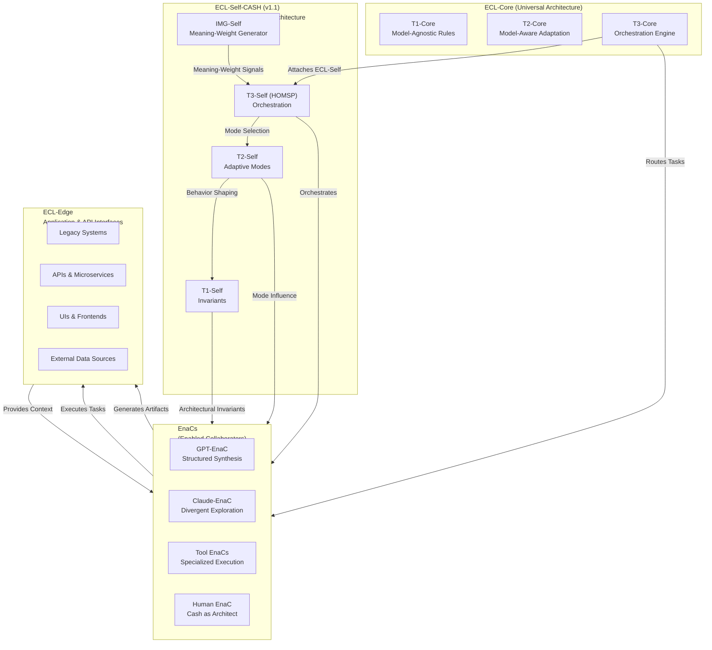

```mermaid
flowchart TD

%% CORE LAYERS
subgraph CORE["ECL-Core (Universal Architecture)"]
    C1[T1-Core<br/>Model-Agnostic Rules]
    C2[T2-Core<br/>Model-Aware Adaptation]
    C3[T3-Core<br/>Orchestration Engine]
end

%% SELF LAYERS
subgraph SELF["ECL-Self-CASH (v1.1)<br/>Personal Cognitive Architecture"]
    S1[T1-Self<br/>Invariants]
    S2[T2-Self<br/>Adaptive Modes]
    S3["T3-Self (HOMSP)<br/>Orchestration"]
    S4[IMG-Self<br/>Meaning-Weight Generator]
end

%% ENAC
subgraph ENAC["EnaCs<br/>(Enabled Collaborators)"]
    E1[GPT-EnaC<br/>Structured Synthesis]
    E2[Claude-EnaC<br/>Divergent Exploration]
    E3[Tool EnaCs<br/>Specialized Execution]
    E4[Human EnaC<br/>Cash as Architect]
end

%% EDGE
subgraph EDGE["ECL-Edge<br/>Application & API Interfaces"]
    X1[Legacy Systems]
    X2[APIs & Microservices]
    X3[UIs & Frontends]
    X4[External Data Sources]
end

%% RELATIONSHIPS
%% Core <-> Self
C3 -->|Attaches ECL-Self| S3
S4 -->|Meaning-Weight Signals| S3
S3 -->|Mode Selection| S2
S2 -->|Behavior Shaping| S1

%% EnaC binds to Self
S3 -->|Orchestrates| ENAC
ENAC -->|Executes Tasks| EDGE

%% EnaC alignment
S1 -->|Architectural Invariants| ENAC
S2 -->|Mode Influence| ENAC

%% Core orchestrates EnaCs
C3 -->|Routes Tasks| ENAC

%% Edge <-> EnaC
EDGE -->|Provides Context| ENAC
ENAC -->|Generates Artifacts| EDGE
```