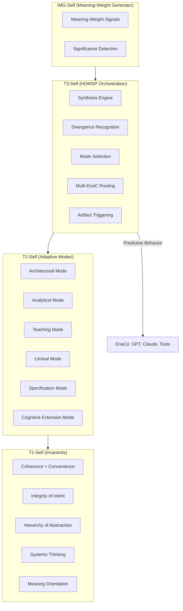

# ECL-Self-CASH v1.1 — Architecture Diagram  
## Version 0.1  
## Mermaid Diagram of Full Cognitive Architecture

```mermaid
flowchart TD

subgraph T1["T1-Self (Invariants)"]
    A1[Coherence > Convenience]
    A2[Integrity of Intent]
    A3[Hierarchy of Abstraction]
    A4[Systems Thinking]
    A5[Meaning Orientation]
end

subgraph T2["T2-Self (Adaptive Modes)"]
    M1[Architectural Mode]
    M2[Analytical Mode]
    M3[Teaching Mode]
    M4[Liminal Mode]
    M5[Specification Mode]
    M6[Cognitive Extension Mode]
end

subgraph T3["T3-Self (HOMSP Orchestration)"]
    O1[Synthesis Engine]
    O2[Divergence Recognition]
    O3[Mode Selection]
    O4[Multi-EnaC Routing]
    O5[Artifact Triggering]
end

subgraph IMG["IMG-Self (Meaning-Weight Generator)"]
    I1[Meaning-Weight Signals]
    I2[Significance Detection]
end

IMG --> T3
T3 --> T2
T2 --> T1
T3 -->|Predictive Behavior| EnaC[EnaCs: GPT, Claude, Tools]
```

---

# End of File
