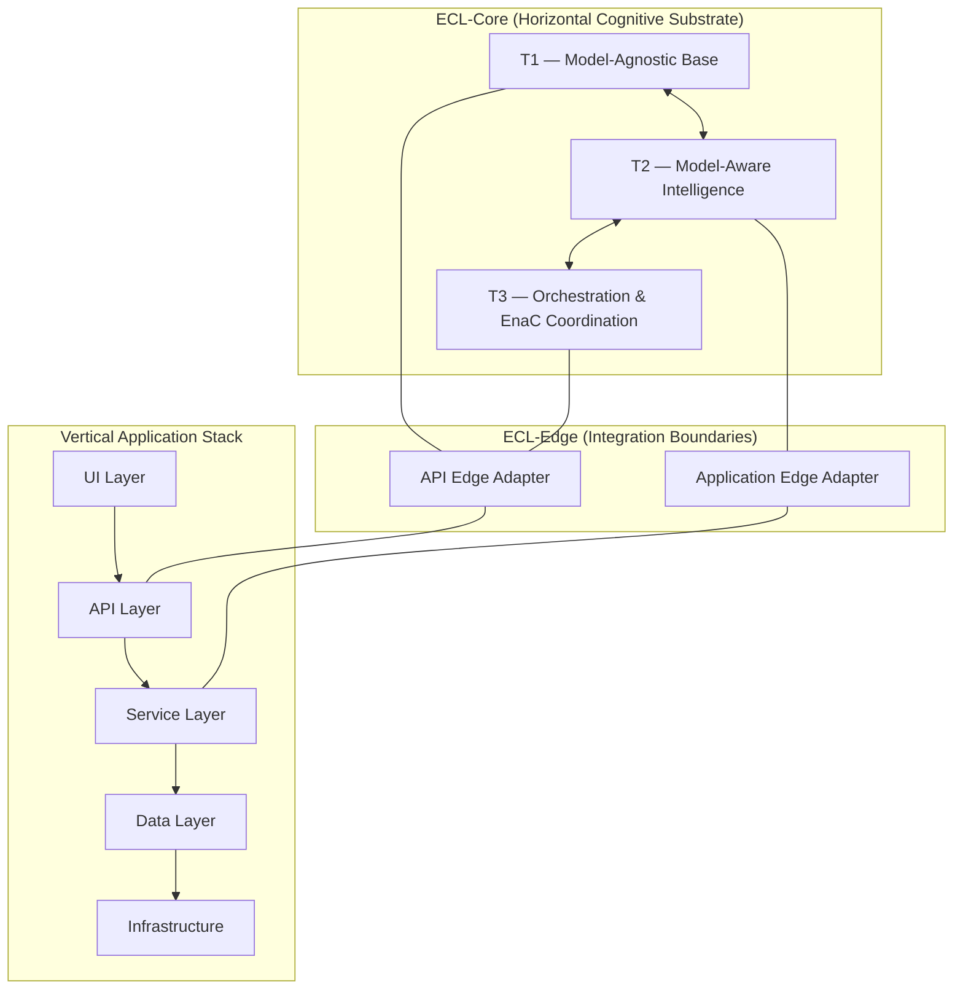

# ECL Layer Interaction Diagram

## Overview
This document provides a conceptual and structural diagram of the ECL (Evolutionary Cognitive Layers) architecture, showing the relationship between:

- Vertical Application Stack (UI → API → Services → Data → Infra)
- Horizontal Cognitive Layers (T1, T2, T3)
- Edge Integration Layers (ECL-Edge)

## Mermaid Diagram

## Layer Relationships

### ECL-Core (Horizontal)
- Spans across all vertical layers.
- Ensures consistent cognitive intent.
- Maintains system invariants during evolution.

### Vertical Stack (Application Structure)
- Provides the operational substrate for system execution.
- Each layer remains stable despite internal architectural evolution.

### ECL-Edge (Boundary)
- Translates cognitive intent into system-specific API or service calls.
- Handles discrepancies between evolving ECL-Core and static external systems.

## Summary
The ECL architecture overlays intelligent cognition across traditional vertical stacks, ensuring adaptability, durability, and interoperability while preserving semantic intent.
