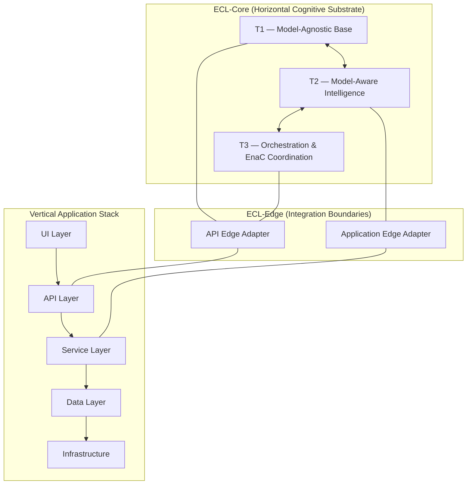

# ECL & MxVA Master Document
## Evolutionary Cognitive Layers and Maximum Value Architecture

---

## 0. Overview

This master document consolidates the foundational artifacts of the ECL (Evolutionary Cognitive Layers) and MxVA (Maximum Value Architecture) ecosystem:

1. From Versioning to Evolutionary Architecture (Whitepaper Section)
2. ECL-Core vs ECL-Edge Responsibilities & Boundary Contract
3. ECL Layer Interaction Diagram
4. The MxVA Manifesto
5. CTO / Engineer Talk Track
6. ECL-Edge Templates & Scaffolds

Each section can stand alone or function as part of a cohesive architectural narrative.

---

## 1. From Versioning to Evolutionary Architecture: The Shift to ECL

### 1.1 Introduction
For over two decades, software evolution has been governed almost entirely by Semantic Versioning (SemVer) — a system designed to regulate breaking changes, coordinate dependency resolution, and maintain compatibility across distributed systems.

SemVer assumed a world where:

- architectural change is expensive  
- migration must be choreographed  
- breaking behaviors must be avoided  
- intent must be reconstructed manually  
- complexity accumulates over time  

This worked — when software was static, modular, and fundamentally non-cognitive.

But as AI systems have entered the development pipeline, as multi-agent orchestration has emerged, and as collaborative cognition became embedded in the architecture itself, SemVer’s underlying assumptions have become constraints, not guarantees.

We have entered the first era where software is not merely built — it evolves.

This shift requires a new architectural foundation.

### 1.2 The Limits of Version-Based Architecture
Semantic Versioning is designed around three principles:

1. **Change is expensive**  
   Every breaking change introduces friction, requires migration, and risks regressions.

2. **Architecture is static**  
   The system’s scaffolding is assumed constant over time.

3. **Behavior must be preserved**  
   Mixing behavior with structure forces stability constraints on change velocity.

In a modern AI-augmented environment, all three assumptions fail.

- **Change is no longer expensive** when AI handles refactoring, verification, and migration planning.
- **Architecture is no longer static** when cognitive layers can self-align and adapt.
- **Behavior can be preserved independently of structure**, enabling internal shifts without external breakage.

The result is a fundamental contradiction:

> **AI makes internal change cheap, but SemVer makes external change hard.**

This tension reveals the breaking point in the old paradigm.

### 1.3 The Emergence of Evolutionary Architecture
Evolutionary Architecture (ECL — Evolutionary Cognitive Layers) represents the first formal system designed to operate in an environment where:

- humans,
- AI agents,
- and the architecture itself

continuously co-evolve.

Instead of “versioning” to manage risk, ECL introduces:

- **T1: Model-Agnostic Cognitive Foundation**  
  A stable substrate of intent, principles, constraints, and rules that remain invariant regardless of structural changes.

- **T2: Model-Aware Intelligence**  
  A layer that adapts to the cognitive characteristics of the LLM executing the architecture, without altering the T1 foundation.

- **T3: Orchestration & Multi-Agent Cognition**  
  A collaborative, distributed operating mode enabling multiple entities (EnaCs) to work in coordination while sharing a unified intent layer.

This tri-layer cognitive substrate decouples intent from implementation, enabling the architecture to evolve internally without breaking external integrations.

### 1.4 Why Breaking Changes Stop Being Breaking Changes
With ECL, architectural change is absorbed horizontally rather than vertically.

**Traditional Architecture (Vertical Stack)**  
UI → API → Services → Domain → DB → Infra  
Changes propagate downward (or upward) and break consumers.

**ECL Architecture (Horizontal Cognitive Layer)**  
The T1–T3 cognitive substrate sits across the entire system, preserving:

- semantic intent  
- behavioral expectations  
- interaction contracts  
- cognitive boundaries  

This means:

- internal implementation can shift massively  
- external systems remain unaffected  
- edge adapters localize change  
- intent remains stable even when structure changes  

It transforms:

- breaking changes → internal evolution events  
- migrations → recalibrations  
- deprecations → reinterpretations  

This is the first architecture designed for systems that learn, adapt, and co-evolve with human and organizational behavior.

### 1.5 The Role of ECL-Edge Layers
ECL introduces a clean separation between:

- **ECL-Core:** The cognitive substrate (T1/T2/T3)  
- **ECL-Edge:** Domain-, app-, or API-specific integration layers  

ECL-Edge layers handle:
- API contracts  
- product-specific quirks  
- domain rules  
- versioned external dependencies  

ECL-Core handles:
- meaning  
- intent  
- collaboration  
- reasoning  
- behavior  

This separation allows for:

- local changes (Edge) without affecting
- global cognition (Core)

This is the exact opposite of vertical refactor pain.

### 1.6 The Displacement of Semantic Versioning
ECL does not “replace” SemVer; it supersedes its scope.

SemVer manages software structure.  
ECL manages software meaning and cognitive behavior.

In a world where internal refactoring is cheap and automated, but preserving intent is priceless, ECL becomes the architectural layer that insulates meaning from mechanical change.

This is evolutionary architecture.

### 1.7 The MxVA Shift — Maximum Value Architecture
The classical path:

> MVP → Prototype → Refactor → Stabilize → Scale

is replaced with:

> ECL-Core → minimal Edge Layer → AI-refined iteration → continuous evolution

The cost of change collapses.  
The cost of not evolving becomes the real risk.

This is the foundation of MxVA (Maximum Value Architecture):

- Build intent first  
- Build cognition second  
- Build interfaces last  
- Let the system evolve continuously  
- Attach domain behavior via controlled boundaries  
- Preserve meaning across structural evolution  

### 1.8 Conclusion
Versioning frameworks were built for a world where architecture was rigid, refactoring was expensive, and behavior was intertwined with structure.

ECL was built for a world where:

- AI handles complexity  
- cognitive layers preserve meaning  
- systems evolve in place  
- teams collaborate with orchestration-aware LLMs  
- architecture can transform without breaking  

This is the shift:

**From versioning to evolution.  
From rigidity to adaptability.  
From MVP to MxVA.**

ECL is the next architectural era.

---

## 2. ECL-Core vs ECL-Edge Responsibilities & Boundary Contract

### 2.1 ECL-Core Responsibilities
- Provide tiered cognitive modes (T1/T2/T3)  
- Preserve semantic intent across structural changes  
- Govern AI collaboration and EnaC behavior  
- Maintain system invariants (OS-1, DOD-1, Rule 0)  
- Ensure orchestration logic and self-alignment  

### 2.2 ECL-Edge Responsibilities
- Map ECL-Core intent to domain-specific APIs and workflows  
- Handle versioned external systems and integrations  
- Contain domain rules without polluting core semantics  
- Serve as replaceable adapters for UI, API, and workflow integration  

### 2.3 Boundary Contract
- ECL-Core never depends on domain specifics.  
- ECL-Edge must respect cognitive intent from Core.  
- All external integrations pass through Edge adapters.  
- Core evolution must not break Edge contracts; Edge absorbs change.

---

## 3. ECL Layer Interaction Diagram

### 3.1 Mermaid Diagram

### 3.2 Layer Relationships

**ECL-Core (Horizontal)**  
- Spans across all vertical layers.  
- Ensures consistent cognitive intent.  
- Maintains system invariants during evolution.

**Vertical Stack (Application Structure)**  
- Provides the operational substrate for system execution.  
- Each layer remains stable despite internal architectural evolution.

**ECL-Edge (Boundary)**  
- Translates cognitive intent into system-specific API or service calls.  
- Handles discrepancies between evolving ECL-Core and static external systems.

---

## 4. MxVA Manifesto

(Full manifesto content preserved from prior artifact.)

### 4.1 Premise: Software Should Evolve, Not Decay
For decades, software architecture has treated change as a risk to be managed rather than a capability to be amplified...

[Full manifesto text continues here – see `mxva_manifesto.md` for complete content.]

---

## 5. CTO/Engineer Talk Track

A flexible 10–30 minute presentation script for introducing ECL and MxVA to technical and executive audiences.

(See `ecl_mxva_talk_track.md` for full content.)

---

## 6. ECL-Edge Templates & Scaffolds

Standard patterns and code scaffolds for defining:

- Edge adapter responsibilities  
- API Edge and App Edge implementations  
- Boundary enforcement helpers  
- Core ↔ Edge integration flows  
- EnaC-aware extension points  

(See `ecl_edge_templates_scaffolds.md` for full content.)

---
