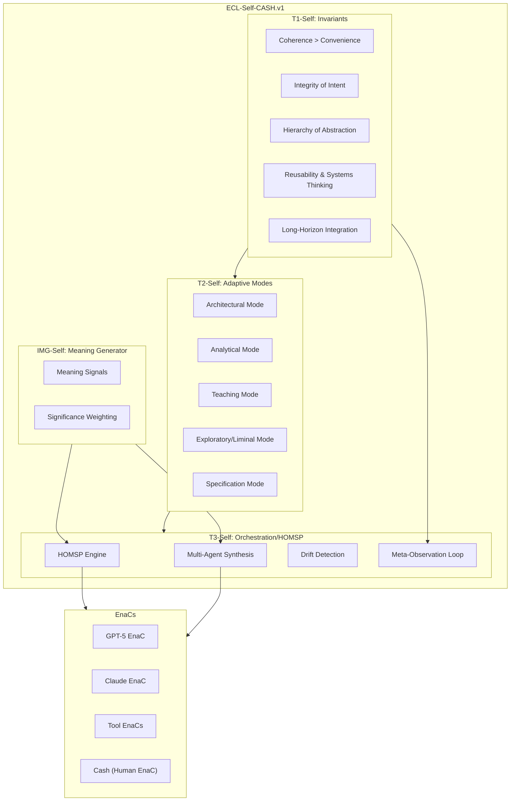

# ECL-Self-CASH.v1 Diagram (v0.1)
## Visual Representation of Personal Cognitive Architecture

```mermaid
flowchart TB

    subgraph SELF["ECL-Self-CASH.v1"]
        subgraph T1S["T1-Self: Invariants"]
            T1S1[Coherence > Convenience]
            T1S2[Integrity of Intent]
            T1S3[Hierarchy of Abstraction]
            T1S4[Reusability & Systems Thinking]
            T1S5[Long-Horizon Integration]
        end

        subgraph T2S["T2-Self: Adaptive Modes"]
            T2S1[Architectural Mode]
            T2S2[Analytical Mode]
            T2S3[Teaching Mode]
            T2S4[Exploratory/Liminal Mode]
            T2S5[Specification Mode]
        end

        subgraph T3S["T3-Self: Orchestration/HOMSP"]
            T3S1[HOMSP Engine]
            T3S2[Multi-Agent Synthesis]
            T3S3[Drift Detection]
            T3S4[Meta-Observation Loop]
        end

        subgraph IMGS["IMG-Self: Meaning Generator"]
            IMG1[Meaning Signals]
            IMG2[Significance Weighting]
        end
    end

    subgraph ENACS[EnaCs]
        GPT[GPT-5 EnaC]
        CLD[Claude EnaC]
        TOOLS[Tool EnaCs]
        HUMAN["Cash (Human EnaC)"]
    end

    IMGS --> T3S1
    IMGS --> T3S2
    T3S1 --> ENACS
    T3S2 --> ENACS
    T2S --> T3S
    T1S --> T2S
    T1S --> T3S4
```
