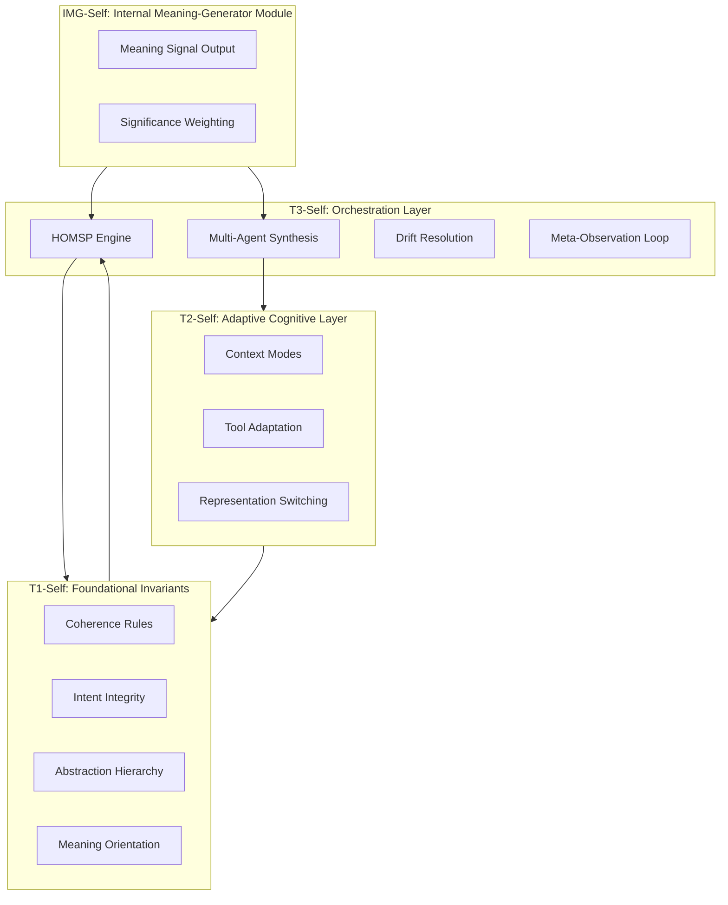

# ECL-Self Diagram (v0.1)
## Visual Model Including T1-Self, T2-Self, T3-Self, and IMG-Self

```mermaid
flowchart TB

    subgraph T1[T1-Self: Foundational Invariants]
        T1A[Coherence Rules]
        T1B[Intent Integrity]
        T1C[Abstraction Hierarchy]
        T1D[Meaning Orientation]
    end

    subgraph T2[T2-Self: Adaptive Cognitive Layer]
        T2A[Context Modes]
        T2B[Tool Adaptation]
        T2C[Representation Switching]
    end

    subgraph T3[T3-Self: Orchestration Layer]
        T3A[HOMSP Engine]
        T3B[Multi-Agent Synthesis]
        T3C[Drift Resolution]
        T3D[Meta-Observation Loop]
    end

    subgraph IMG[IMG-Self: Internal Meaning-Generator Module]
        IMG1[Meaning Signal Output]
        IMG2[Significance Weighting]
    end

    IMG --> T3A
    IMG --> T3B
    T3A --> T1
    T3B --> T2
    T2 --> T1
    T1 --> T3A
```
