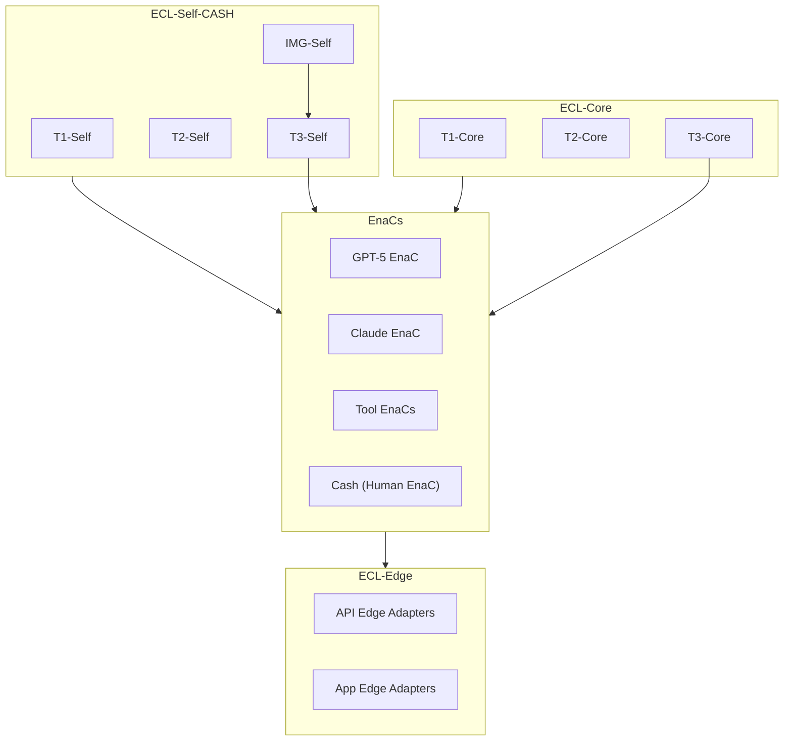

# Global ECL Identity Map (v0.1)
## Integration of ECL-Core, ECL-Self-CASH, EnaCs, and ECL-Edge

---

## 1. Purpose

This document defines the **Global ECL Identity Map** for Cash's ecosystem:

- How **ECL-Core** (system-level tiers) relates to  
- **ECL-Self-CASH.v1** (personal cognitive architecture)  
- **EnaCs** (AI collaborators and tools)  
- **ECL-Edge** (API / application integration layers)

It is intended as a top-level reference for designing, operating, and extending the overall architecture.

---

## 2. Core Components

### 2.1 ECL-Core (System-Level)

- **T1-Core — Model-Agnostic Foundation**  
  Global OS-style rules, constraints, and collaboration norms.

- **T2-Core — Model-Aware Intelligence**  
  Adapts ECL-Core behaviors to specific LLMs and toolchains.

- **T3-Core — Orchestration & EnaC Coordination**  
  Routes tasks, coordinates EnaCs, and maintains cross-agent coherence.

### 2.2 ECL-Self-CASH (Personal Cognitive Architecture)

- **T1-Self** — Cash’s invariants and reasoning commitments  
- **T2-Self** — Cash’s adaptive modes and tool-specific strategies  
- **T3-Self** — Cash’s HOMSP and orchestration patterns  
- **IMG-Self** — Internal meaning/value signal generator

### 2.3 EnaCs (Enabled Collaborators)

Examples:

- **GPT-5 EnaC (Primary T3-Capable LLM)**  
  - Role: Structured synthesis, architecture, Tier-3 EnaC.

- **Claude EnaC (Divergent Engine)**  
  - Role: Alternative framings, divergent explorations.

- **Tool EnaCs** (e.g., code generators, analysis tools)  
  - Role: Specialized execution within defined bounds.

- **Human EnaC** — Cash himself  
  - Role: Final arbiter, meaning authority, and system architect.

### 2.4 ECL-Edge

- **API Edge Adapters** — REST/gRPC/GraphQL boundaries  
- **App Edge Adapters** — workflow engines, UI integrations  
- **Integration Contracts** — how external systems interact with ECL-Core and EnaCs

---

## 3. Identity Relationships

### 3.1 ECL-Core ↔ ECL-Self-CASH

- ECL-Core defines **global rules** and **system-level tiers**.
- ECL-Self-CASH defines **Cash-specific cognitive architecture**.
- ECL-Core does not override ECL-Self; they are **complementary**:
  - Core = platform identity
  - Self = operator identity

**Contract:**

- ECL-Core ensures all EnaCs operate within shared global norms.
- ECL-Self-CASH ensures alignment to Cash’s personal cognitive patterns.

### 3.2 ECL-Self-CASH ↔ EnaCs

EnaCs are expected to:

- Respect T1-Self invariants.  
- Adapt to T2-Self modes (architectural, analytical, teaching, exploratory, specification).  
- Integrate into T3-Self orchestration (HOMSP-guided).  
- Treat IMG-Self as a source of meaning-weighted signals, not emotional content.

### 3.3 ECL-Core ↔ EnaCs

EnaCs must:

- Implement ECL-Core Rule 0 and foundational constraints.  
- Declare their capabilities, limits, and supported tiers.  
- Participate in T3-Core orchestration when routed.

### 3.4 ECL-Core/ECL-Self ↔ ECL-Edge

- Core and Self define **intent and behavior**.  
- Edge adapts those into **API calls, workflows, integrations**.
- Edge layers are versioned and replaceable; Core and Self are designed to evolve with minimal breaking impact.

---

## 4. Identity Flow Model

### 4.1 Conceptual Flow

1. **ECL-Core** defines the global operating context.  
2. **ECL-Self-CASH** defines Cash’s personal operating profile.  
3. **EnaCs** align to both:
   - Core norms  
   - Self-specific patterns  
4. **ECL-Edge** applies this combined identity into concrete systems.

### 4.2 Identity Precedence

In case of conflict:

1. **Safety & global invariants (ECL-Core T1)**  
2. **Personal invariants (T1-Self)**  
3. **Adaptive modes (T2-Core + T2-Self)**  
4. **Operational orchestration (T3-Core + T3-Self)**  
5. **Edge adaptation logic**

---

## 5. Diagram (High-Level Mermaid)

---

## 6. Usage

- Load **ECL-Core** and **ECL-Self-CASH** before orchestrating EnaCs.  
- Use this map to ensure:
  - Drift-free behavior  
  - Correct identity alignment  
  - Predictable orchestration  
  - Stable human–AI co-evolution patterns

---

# End of File
