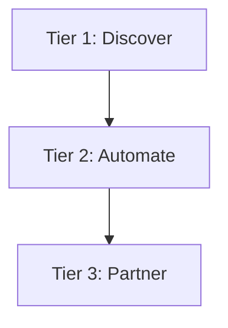

# The Cognitive Foundations Platform (CFP)
## A New Way to Think, Work, and Create With AI
*Introductory Guide for Early Access Beta Participants*

---

# A Quiet Revolution in How People Work With AI

If you’ve ever had a great session with an AI — where everything just *clicked* — you’ve probably felt the frustration the next day.

The magic was gone.
The understanding was gone.
The rhythm was gone.
And you had to start over from scratch.

Writers re-explain their voice.
Developers re-explain architectures.
Leaders re-explain goals.
Creators re-explain style.
Project managers re-explain context.
Entrepreneurs re-explain vision.

Every. Single. Time.

That repetition isn’t just annoying — it breaks flow, drains motivation, and disrupts your ability to think deeply with an AI.

And that’s the moment the idea behind the Cognitive Foundations Platform (CFP) was born.

A moment you’ve likely experienced yourself.

---

## The Why Behind CFP (Origin Story)

CFP wasn’t created as a product.
It emerged from a simple, deeply human need:

> **“I want the AI to remember how to collaborate with me — not just respond to me.”**

During a long-form collaboration (much like the one that led to this article), something unexpected happened:

- The AI began anticipating context.
- It remembered patterns without being reminded.
- It organized tasks intuitively.
- The interaction felt more like a *partner* than a *tool.*
- It was the kind of breakthrough moment every AI user has tasted — but can’t consistently recreate.

Then the session ended…
…and all of that progress vanished.

That was the spark.

- What if there were a system that preserved the cognitive state of the collaboration?
- What if every session could be a continuation rather than a reset?
- What if AI could be taught to work with you the way *you* work — instead of the way it defaults?

---

## The Cognitive Foundations Platform (CFP) was created to solve exactly that.

CFP ensures your collaboration doesn’t restart every time you open a new session.

It preserves your preferences.
It stabilizes your working style.
It carries your cognitive rhythm forward.
It lets your work *compound* instead of reset.

---

# The Real Problem Isn’t Intelligence — It’s Continuity

Modern AI suffers from seven persistent gaps:

1. **No cross-session memory of your way of working**
2. **No stable interpretation of your intent**
3. **No retention of your preferences**
4. **No long-term project continuity**
5. **No sense of cognitive rhythm**
6. **No accumulation of momentum**
7. **No relationship layer**

This isn’t a flaw in AI.
It is simply the absence of the correct infrastructure.

CFP supplies that infrastructure.

---

# What CFP Actually Does

CFP is a **Collaboration Layer** that enhances any AI by giving it:

- A structured model of your working style
- Stable rules for interpreting your instructions
- A continuity framework that spans sessions
- A project-scaffolding layer
- Tools that reduce repetition
- Reasoning modes that adapt to you
- A shared cognitive rhythm

Most AI tools help you get tasks done.

CFP helps you **think.**
That’s the difference.

---

# The CFP Stack (Correct Orientation)

+------------------------------------------------+
|   Tier 1 — Discover (Free Tier)                |
|   Foundations for Clear, Structured Work       |
+------------------------------------------------+
|   Tier 2 — Automate (Premium Tier)             |
|   Workflows, Persistence, & Quick Prompts      |
+------------------------------------------------+
|   Tier 3 — Partner (Enterprise Tier)           |
|   Continuity, Adaptation & Relationship Memory |
+------------------------------------------------+

---

# The Three CFP Tiers

## Tier 1 — Discover
### *The Foundation Layer (Free Tier)*

Tier 1 trains the AI to understand:

- What you want
- Why you want it
- How you think
- How you prefer information
- How to structure tasks in ways that reduce friction

It includes:

- Structured prompting tools
- Reflection and multi-angle reasoning modes
- Context-layering
- Ethical collaboration safeguards
- Interpretation frameworks

---

## Tier 2 — Automate
### *The Workflow Layer (Premium Tier)*

Tier 2 is where your work starts compounding.

It adds:

- Persistent Quick Prompts
- Workflow scaffolding
- Cross-session recall
- Reusable structured commands
- Project anchors
- Stabilization of your work patterns

Ideal for:

- Writers
- Developers
- PMs
- Creators
- SMB owners

---

## Tier 3 — Partner
### *The Continuity & Adaptation Layer (Enterprise Tier)*

Tier 3 turns AI into a **continuity partner**.

It includes:

- Collaboration Style Profile
- Work Style Adaptation
- Continuity Reconstruction
- Team Collaboration Mapping
- Cognitive Rhythm Modeling

This tier creates a *relationship layer* — continuity that supports real long-term collaboration.

---

# CFP Feature Matrix (Full Version)
### **41 Features Across 9 Categories**

---

## Category 1 — Collaboration Foundations (6)
| Feature | T1 | T2 | T3 |
|--------|----|----|----|
| Structured Prompting Framework | ✔ | ✔ | ✔ |
| Context Layering | ✔ | ✔ | ✔ |
| Intent Clarification Engine | ✔ | ✔ | ✔ |
| Multi-Domain Reasoning | ✔ | ✔ | ✔ |
| Ethical Collaboration Protocol | ✔ | ✔ | ✔ |
| Task Interpretation Mode | ✔ | ✔ | ✔ |

---

## Category 2 — Reflection & Analysis Tools (5)
| Feature | T1 | T2 | T3 |
|--------|----|----|----|
| Multi-Angle Reflection | ✔ | ✔ | ✔ |
| Deep Context Re-evaluation | ✔ | ✔ | ✔ |
| Assumption Surfacing | ✔ | ✔ | ✔ |
| Goal Alignment Checker | ✔ | ✔ | ✔ |
| Priority Extraction | ✔ | ✔ | ✔ |

---

## Category 3 — Workflow Automation (7)
| Feature | T1 | T2 | T3 |
|--------|----|----|----|
| Quick Prompts | — | ✔ | ✔ |
| Workflow Scaffolding | — | ✔ | ✔ |
| Persistent Task Structures | — | ✔ | ✔ |
| Session Anchors | — | ✔ | ✔ |
| Reusable Prompt Blocks | — | ✔ | ✔ |
| Cross-Session Task Recall | — | ✔ | ✔ |
| Focus/Exploration Mode Switching | — | ✔ | ✔ |

---

## Category 4 — Context Management (8)
| Feature | T1 | T2 | T3 |
|--------|----|----|----|
| Micro-Context Storage | ✔ | ✔ | ✔ |
| Extended Working Memory | ✔ | ✔ | ✔ |
| Context Rehydration | — | ✔ | ✔ |
| Retrieval-Aware Scaffolding | — | ✔ | ✔ |
| Project Context Anchors | — | ✔ | ✔ |
| Distraction Guardrails | — | ✔ | ✔ |
| Scope Drift Alerts | ✔ | ✔ | ✔ |
| Meaning Preservation Engine | ✔ | ✔ | ✔ |

---

## Category 5 — Continuity & Reconstruction (6)
| Feature | T1 | T2 | T3 |
|--------|----|----|----|
| Cross-Session Continuity Foundations | ✔ | ✔ | ✔ |
| Context Reconstruction from Prior Files | — | ✔ | ✔ |
| Session Recovery Protocol | — | ✔ | ✔ |
| Deep Continuity Layer | — | — | ✔ |
| Relationship Memory | — | — | ✔ |
| Cognitive Rhythm Restoration | — | — | ✔ |

---

## Category 6 — Personalization & Adaptation (4)
| Feature | T1 | T2 | T3 |
|--------|----|----|----|
| Style Recognition | ✔ | ✔ | ✔ |
| Collaboration Style Profile | — | — | ✔ |
| Work Style Adaptation | — | — | ✔ |
| Adaptive Reasoning System | — | — | ✔ |

---

## Category 7 — Multi-User & Team Tools (3)
| Feature | T1 | T2 | T3 |
|--------|----|----|----|
| Multi-User Role Mapping | — | — | ✔ |
| Context Switching Between Users | — | — | ✔ |
| Team Continuity Mode | — | — | ✔ |

---

## Category 8 — Safety & Alignment (3)
| Feature | T1 | T2 | T3 |
|--------|----|----|----|
| Ethical Collaboration Boundaries | ✔ | ✔ | ✔ |
| User-Controlled Transparency Notices | ✔ | ✔ | ✔ |
| Intent Validation | ✔ | ✔ | ✔ |

---

## Category 9 — Quick Access Tools (3)
| Feature | T1 | T2 | T3 |
|--------|----|----|----|
| Quick Tasks | — | ✔ | ✔ |
| Shortcuts Library | — | ✔ | ✔ |
| One-Shot Pipelines | — | ✔ | ✔ |

---

# Visual Tier Progression

---

# Join the Early Access Beta

CFP is currently in **Early Access Beta**, and we are inviting individuals who:

- Use AI frequently
- Value consistency
- Want deeper collaboration
- Prefer structured workflows
- Appreciate momentum
- Think beyond one-off prompts

If that describes you, this is the moment to step in.

---

# Final Thought

AI shouldn't forget who you are.
Or how you think.
Or what you’re building.
Or why it matters.

With CFP, it won’t.

The future of AI isn’t prompting —
it’s **partnership.**
