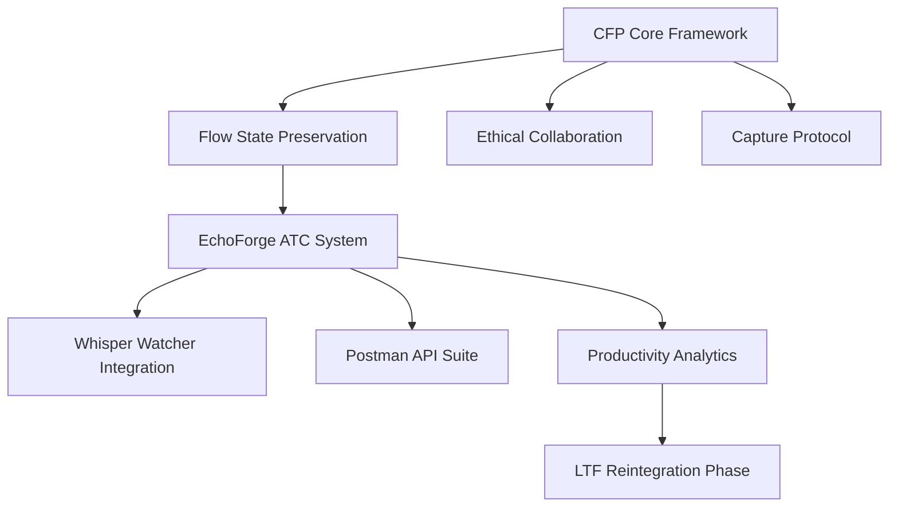

# CFP Final Idea Map — Session 2025-11-11
**Captured via:** CFP Capture Protocol (Flow State: Reintegration Phase)  
**Purpose:** Summarize the cumulative idea architecture generated during the CFP/EchoForge/LTF creative exploration.

---

## 🧩 Core Idea Clusters

### 1. CFP Framework Enhancements
- Ethical Collaboration and transparency footer improvements.  
- Flow State Preservation documented as operational model.  
- Multi-format output support (MD, DOCX, PDF).  
- Tiered CFP models for scalability and monetization.

### 2. EchoForge (AI Thought Capture)
- Core concept: transforming creative flow into structured knowledge.  
- Full technical specification created (v0.9 Founders’ Draft).  
- REST API endpoints, JSON schema, and pseudocode.  
- Postman collection for validation and integration testing.

### 3. Whisper Integration (Input Adapter)
- Event-driven watcher → EchoForge bridge.  
- JSON schema for ingestion events (session/project aware).  
- Configurable STT modes: `use_watcher`, `internal_whisper`, `auto`.  
- Productivity analytics through timestamped capture logs.

### 4. Flow State Intelligence
- Expanded behavior tracking for idea detection, deferred structuring, and post-flow synthesis.  
- Flow continuity metrics (semantic drift <2%, 0 interruptions).  
- Reintegration readiness and next-session continuity anchors.

### 5. Productivity Analytics
- Quantified productivity uplift: **≈8.5× improvement** vs. solo baseline.  
- Cross-domain coherence (architecture + documentation).  
- CFP Productivity Comparison report formalized with weighted analysis.

### 6. Future Development Path
- LTF integration via Snapshot/Resume ingestion.  
- EchoForge commercialization roadmap (Tier 2/3 monetization).  
- Modular export adapters (Notion, Obsidian, GitHub).  
- AI-collaborative data models for ethical transparency.

---

## 🧠 Idea Interdependencies

---

**Captured via:** CFP Capture Protocol  
**Flow Stage:** Reintegration  
**Transparency:** Co-authored summary of conceptual and technical evolution through AI-assisted ideation.
