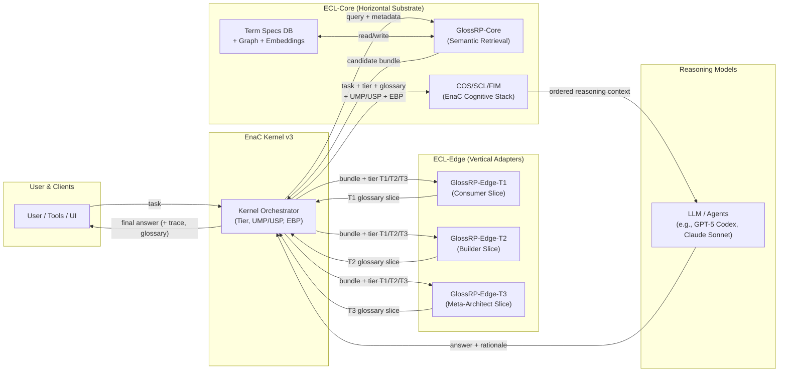

Read it top-to-bottom:

- User / tools send a task → Kernel.
- Kernel talks to GlossRP-Core (Core), then sends the neutral bundle to the correct GlossRP-Edge-Tx (Edge) based on Tier.
- Kernel takes the Tier-shaped slice + UMP/USP + EBP and runs it through COS/SCL/FIM, then into the LLM.
- LLM returns an answer; Kernel wraps it with trace + glossary back to the user.
- Term Specs DB + graph + embeddings sit in Core under GlossRP-Core.
